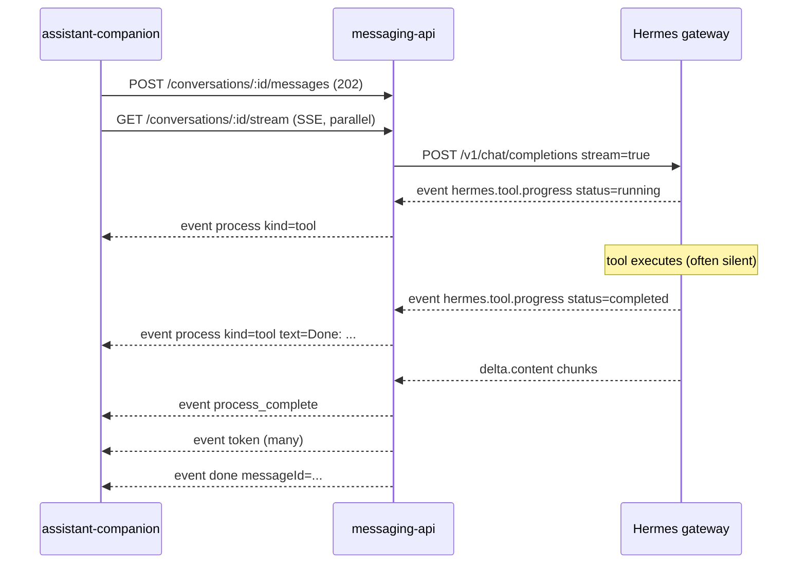

# Companion Live Streaming — iOS Debug Guide

**Date:** 2026-06-17  
**Audience:** Agents and developers working in `assistant-companion` (iOS)  
**Backend contract:** messaging-api OpenAPI v1.8.0+ (`docs/superpowers/specs/messaging-api.openapi.yaml`)  
**Related plan:** `docs/history/plans/2026-06-15-companion-live-streaming-ios.md`

---

## Purpose

This document explains how the **two-lane assistant stream** works end-to-end, what the backend guarantees, and how to debug the common failure mode:

> Reply text streams live, but tooling/reasoning only appears after the run finishes.

Use this when investigating SSE handling, `ChatViewModel` state, or stream connection timing in the iOS app.

---

## Architecture (three hops)



| Layer | Responsibility |
|-------|----------------|
| **Hermes** (`/v1/chat/completions`) | Runs the agent; emits tool lifecycle via `hermes.tool.progress` and answer text via `delta.content` |
| **messaging-api** | Parses Hermes SSE, formats friendly tool labels, republishes companion SSE events, persists `message_process` on completion |
| **iOS** | Opens stream early, maintains separate UI state for process vs reply, renders live before `done` |

Hermes is reached only by messaging-api (not directly by the app). The iOS client talks exclusively to messaging-api.

---

## The two lanes

While a message is in flight, the user should see **two independent UI regions**:

| Lane | SSE events | UI behavior |
|------|------------|-------------|
| **Process block** | `process_token`, `process`, `process_complete` | Shows reasoning and tool activity while Hermes works; collapses/hides on `process_complete` |
| **Reply bubble** | `token`, then `done` | Shows the final assistant answer token-by-token; commits to message list on `done` |

These lanes are **sequential**, not parallel in time:

1. Process phase — zero or more `process` / `process_token` events
2. Handoff — `process_complete` (only if any process activity occurred)
3. Reply phase — `token` events until `done`

**Instant replies** (no tools, no reasoning): skip process events entirely; `token` streams immediately with no `process_complete`.

---

## SSE contract (companion stream)

Endpoint: `GET /conversations/{id}/stream`  
Auth: Bearer JWT (same as other routes)  
Content-Type: `text/event-stream`  
Lifecycle: stream ends on `done` or `error`; no reconnect/replay within a run

### Events

| Event | Payload | Client action |
|-------|---------|---------------|
| `process_token` | `{ "kind": "reasoning", "text": "..." }` | Append `text` to in-flight reasoning draft inside process block |
| `process` | `{ "kind": "reasoning" \| "tool", "text": "..." }` | Append a **new committed line**. Tool examples: `Listing skills: productivity`, `Done: Searching the web: Lisbon weather` |
| `process_complete` | `{}` | End process phase; show/start reply bubble |
| `token` | `{ "text": "..." }` | Append to streaming reply |
| `title` | `{ "title": "..." }` | Update conversation title (first message only) |
| `rewind` | `{ "removedMessageIds": ["..."] }` | Remove messages from local state (message edit rerun) |
| `done` | `{ "messageId": "uuid" }` | Commit reply; clear streaming buffers |
| `error` | `{ "code": "..." }` | Show failure; clear streaming state |

### Ordering rules

- `process_token` may arrive many times before a matching `process` reasoning line
- Tool-heavy turn typical sequence:
  ```
  process (tool start)
  … silence while tool runs …
  process (Done: …)
  process_complete
  token, token, token, …
  done
  ```
- `title` may interleave anywhere during the first message of a conversation
- Multiple tool rounds in one turn accumulate in **one** process block before `process_complete`

### Historical reload

After `done`, `GET /conversations/{id}/messages` returns assistant messages with an optional persisted blob:

```json
{
  "role": "assistant",
  "content": "It is sunny in Lisbon.",
  "process": {
    "lines": [
      { "kind": "tool", "text": "Searching the web: Lisbon weather" },
      { "kind": "tool", "text": "Done: Searching the web: Lisbon weather" }
    ]
  }
}
```

This is the **scroll-back** source. It must not be the only way the user sees process activity during a live run.

---

## Expected iOS state model

Minimum state for correct live UX (from v1.8.0 plan):

```swift
@Published var processLines: [ProcessLine] = []       // committed process lines
@Published var reasoningDraft: String = ""          // in-flight reasoning (process_token)
@Published var streamingReply: String = ""          // in-flight answer (token)
@Published var isProcessPhaseActive: Bool = false
@Published var isReplyPhaseActive: Bool = false
```

### Event handler checklist

For each SSE event, verify the handler does the following:

| Event | Must do | Common bug |
|-------|---------|------------|
| `process_token` | Set `isProcessPhaseActive = true`; append to `reasoningDraft` | Ignored (falls through to `default`) |
| `process` | Append to `processLines`; clear `reasoningDraft` if `kind == "reasoning"` | Only handled after `done` via history reload |
| `process_complete` | Flush `reasoningDraft` into `processLines`; set `isProcessPhaseActive = false`; set `isReplyPhaseActive = true` | Never handled — reply and process shown in same bubble |
| `token` | Append to `streamingReply` only (not `content` on a finished message) | Works (this lane is usually fine) |
| `done` | Commit `streamingReply` with `messageId`; reset all streaming state | Clears state before user sees final process block |

### Display rules

- **Process block:** render `processLines` + trailing `reasoningDraft` while `isProcessPhaseActive`
- **Reply bubble:** render `streamingReply` while `isReplyPhaseActive` and before `done`
- Do **not** wait for `GET /messages` to populate the process block during an active run

---

## Stream connection timing (critical)

### Rule: open stream in parallel with POST

```
POST /conversations/:id/messages     ─┐
GET  /conversations/:id/stream       ─┴─ start both without waiting
```

**Do not** wait for POST 202 before opening the stream if the client can fire both concurrently.

### Why timing matters

messaging-api uses an in-memory pub/sub (`StreamHub`). Events are published only to **currently connected** listeners. There is **no replay** of `process` / `process_token` for late subscribers (only `rewind` is buffered).

If the stream opens after early tool events:

1. Those `process` lines are **lost** from the live stream
2. The user sees reply tokens live (arriving after connection)
3. On `done`, the full `process` blob appears via history — looks like "tooling only at the end"

This is the most common explanation when the backend is healthy but the app feels broken.

### POST behavior

- `POST /messages` returns **202** immediately with the user message
- Assistant run starts in the background (`executeAssistantRun`)
- Stream attaches to the **active run** for that conversation

### Stream wait window

If no active run exists when the stream opens, the server waits briefly then emits:

```
event: error
data: {"code":"no_active_run"}
```

Open the stream before or concurrently with POST to avoid this race on fast runs.

---

## What the backend guarantees (verified 2026-06-17)

| Capability | Status | Notes |
|------------|--------|-------|
| Live tool start lines | **Yes** | Hermes emits `hermes.tool.progress` `status: running`; API forwards as `process` |
| Live tool completion lines | **Yes** | `Done: …` via `process` when Hermes reports `status: completed` |
| Live reply tokens | **Yes** | `token` events from Hermes `delta.content` |
| Live reasoning (`process_token`) | **No** (today) | Parser exists; Hermes `/v1/chat/completions` does not emit `reasoning_content` deltas on the wire |
| Intra-tool progress | **No** | Silence between tool start and `Done:` is expected (e.g. 20s web search) |
| Event replay for late stream | **No** | By design; client must connect early |
| Persisted process on completion | **Yes** | `message_process` table; returned on `GET /messages` |

Backend implementation references (hermes repo):

- `messaging-api/src/services/hermes-client.ts` — parses Hermes SSE
- `messaging-api/src/services/run-executor.ts` — publishes companion SSE
- `messaging-api/src/streams/hub.ts` — pub/sub (no process replay)

---

## Symptom → diagnosis

| Symptom | Likely cause | Where to look (iOS) |
|---------|--------------|---------------------|
| Reply streams live; process appears only at end | Late stream connection **or** `process` not handled live | Stream open timing; `handleSSEEvent` for `process` / `process_complete` |
| No process block at all during run; appears after reload | `process` events ignored; only reading `message.process` from history | `SSEEvent` enum / decoder; ChatViewModel |
| `process_token` never seen | Expected today — Hermes does not stream reasoning on this path | Not an iOS bug unless backend switches APIs |
| Tool start missing; `Done:` and reply appear | Stream opened after tool start event | Parallelize POST + stream open |
| `no_active_run` on stream | Stream opened before POST, run finished too fast, or wrong conversation id | Race in send flow |
| Process and reply in same bubble | Missing `process_complete` handoff | Separate view state for two lanes |
| Edit rerun shows stale assistant message | `rewind` not handled | `rewind` case in SSE handler |

---

## iOS files to inspect (assistant-companion)

Search the companion repo for these patterns:

| Area | Likely paths / symbols |
|------|------------------------|
| SSE parsing | `SSEParser`, `SSEEvent`, `EventSource`, `URLSession` stream delegate |
| Event dispatch | `handleSSEEvent`, `ChatViewModel`, `StreamingService` |
| Send flow | Code that calls `POST .../messages` and `GET .../stream` — verify parallel start |
| Models | `SseProcessEvent`, `SseProcessTokenEvent`, `Message.process`, `ProcessLine` |
| UI | Process block view vs reply bubble — must be separate, driven by phase flags |
| Tests | `SSEEventDecodingTests` — confirm `process_token` and `process_complete` decode |

### Red flags in code review

```swift
// BAD: only handles known v1.4 events
default: break   // silently drops process_token

// BAD: waits for POST before stream
let post = await api.postMessage(...)
let stream = await api.openStream(...)  // may miss early process events

// BAD: single streaming string for everything
streamingText += payload.text  // for both process and token without branching

// BAD: process only from history
func onDone(messageId:) {
    let messages = await api.getMessages()  // first time process is read
}
```

### Green patterns

```swift
// GOOD: parallel
async let post = api.postMessage(...)
async let stream = api.openStream(...)
_ = try await (post, stream)

// GOOD: typed events
case "process": ...
case "process_token": ...
case "process_complete": ...
case "token": ...
```

---

## Debugging procedure

### Step 1 — Confirm backend is streaming (isolate iOS)

From a machine that can reach messaging-api (Tailscale IP):

1. Authenticate and create/use a conversation
2. Open `GET /conversations/{id}/stream` in one terminal (SSE client or `curl -N`)
3. Immediately `POST /conversations/{id}/messages` with a tool-heavy prompt, e.g.:
   - `"Use skills_list with category productivity and name one skill."`
   - `"Search the web for weather in Lisbon and tell me one fact."`

**Expected SSE output (tool-heavy):**

```
event: process
data: {"kind":"tool","text":"Listing skills: productivity"}

event: process
data: {"kind":"tool","text":"Done: Listing skills: productivity"}

event: process_complete
data: {}

event: token
data: {"text":"..."}

event: done
data: {"messageId":"..."}
```

If this sequence appears in curl but not in the app → **iOS bug** (handler, timing, or UI).

If `process` lines are missing even in curl when stream opens late → **timing bug** (still client-side fix: open earlier).

### Step 2 — Log raw SSE in the app

Add temporary logging in the SSE parser **before** dispatch:

```
[SSE] event=process data={"kind":"tool","text":"Listing skills: productivity"}
```

Log timestamps relative to POST start. Process events should arrive **before** first `token`.

### Step 3 — Verify handler routing

For one test message, assert:

- [ ] `process` increments `processLines.count` before first `token`
- [ ] `isProcessPhaseActive == true` during tool execution
- [ ] `process_complete` fires before first `token`
- [ ] `streamingReply` stays empty until `process_complete` (or until first `token` on instant-reply turns)
- [ ] `done` commits message without wiping visible process block

### Step 4 — Verify UI binding

- Process block bound to `processLines` + `reasoningDraft`, not to `streamingReply`
- Reply bubble bound to `streamingReply` only
- SwiftUI: ensure `@Published` updates happen on `MainActor`

### Step 5 — Regression tests (XCTest)

Add or run tests for:

| Test | Assert |
|------|--------|
| Decode `process_token` | `SSEEvent` not `.unknown` |
| Decode `process_complete` with `{}` | Succeeds |
| Handler: process before token | `processLines` non-empty before `streamingReply` non-empty |
| Handler: `done` | Streaming state cleared; message id stored |

Reference decoding tests from backend parity plan: `docs/history/implemented/plans/2026-06-13-assistant-companion-backend-parity.md` (Phase 2, Task 3).

---

## Test scenarios (manual)

| # | Prompt | Expected live UI |
|---|--------|------------------|
| 1 | "Write a short paragraph about Lisbon." | Reply grows token-by-token; **no** process block |
| 2 | "Use skills_list with category productivity; one skill name only." | `Listing skills: …` appears **before** reply; `Done: …` before reply tokens |
| 3 | "Search the web for Lisbon weather; one fact." | Tool line early; long pause; `Done:` line; then reply streams |
| 4 | Edit last user message and resend | `rewind` removes old pair; process + reply sequence repeats |
| 5 | Background app mid-run, return after `done` | History shows `process.lines` on assistant message |

---

## Known limitations (do not chase as iOS bugs)

1. **Reasoning `process_token`** — Backend parser ready; Hermes chat-completions API does not emit `reasoning_content` today. Live reasoning text will not appear until Hermes or messaging-api integration changes.

2. **Silence during tool execution** — No per-step updates inside a running tool. Only start label and `Done:` line.

3. **No mid-run reconnect** — Disconnecting and reopening `/stream` mid-run does not replay missed process events. Reload history after `done` instead.

4. **`title` interleaving** — On first message, `title` may arrive amid process/token events. Handler should not reset streaming state on `title`.

---

## Backend error codes (stream)

| `error.code` | Meaning | Client action |
|--------------|---------|---------------|
| `no_active_run` | No run in progress when wait window expired | Retry stream with next message; check POST/stream race |
| `hermes_stream_failed` | Hermes stream broke | Show error; offer retry; check Hermes logs |
| `run_conflict` | POST while run active (409 on POST, not stream) | Disable send until current run completes |

---

## References

| Document | Location |
|----------|----------|
| OpenAPI contract (source of truth) | `docs/superpowers/specs/messaging-api.openapi.yaml` |
| iOS implementation plan | `docs/history/plans/2026-06-15-companion-live-streaming-ios.md` |
| Backend process stream design | `docs/history/implemented/specs/2026-06-13-assistant-process-stream-design.md` |
| README operator notes | `README.md` → "Assistant process stream" |
| Backend parity plan (Swift models) | `docs/history/implemented/plans/2026-06-13-assistant-companion-backend-parity.md` |

---

## Quick verdict tree

```
Reply streams live?
├─ No  → token handler / SSE connection broken (wider issue)
└─ Yes → Process only at end?
         ├─ curl shows live process events → iOS handler or stream timing
         ├─ curl missing early process → open stream earlier (parallel POST)
         └─ curl has no process at all on tool-heavy prompt → escalate to hermes workspace (rare)
```

When in doubt: **log raw SSE with timestamps** and compare against the curl baseline in Step 1.