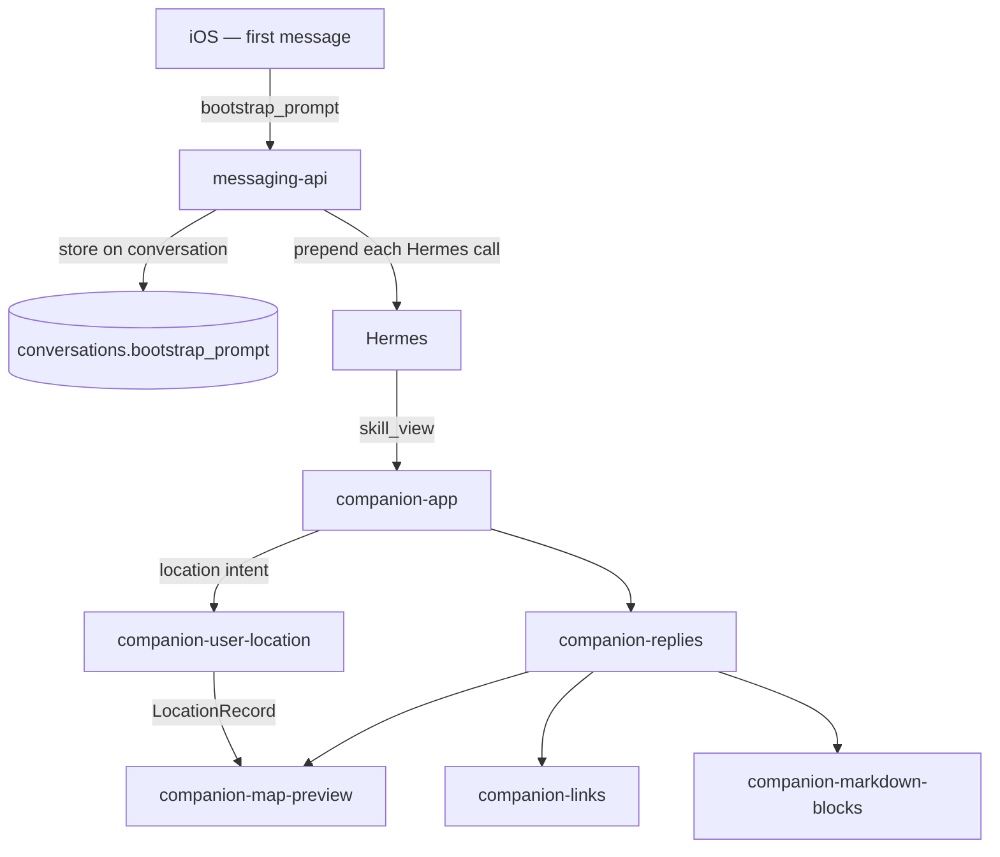

# Companion App Skills Index & iOS Bootstrap — Design Spec

**Date:** 2026-06-17  
**Status:** Approved  
**API version:** v1.9.0 (OpenAPI)  
**Plans:**
- `docs/superpowers/plans/2026-06-17-companion-app-skills-backend.md` — **this repo**
- `docs/superpowers/plans/2026-06-17-companion-app-skills-ios.md` — **reference only; `assistant-companion` repo**  
**OpenAPI:** `docs/superpowers/specs/messaging-api.openapi.yaml`  
**Workspace rules:** `AGENTS.md` — companion- prefix, backend-only implementation, OpenAPI mandatory on contract changes

---

## Goal

Introduce a **`companion-app` index skill** that routes Companion App replies to focused child skills (format blocks, location data). Move skill-bootstrap instructions from hardcoded `messaging-api` system prompts to **iOS-authored bootstrap text**, stored once per conversation and forwarded by the API on every Hermes call.

Separate **data skills** (fetch/normalize) from **format skills** (fences, map blocks, links). Strip presentation logic from `companion-user-location`.

---

## Repository scope

| Artifact | Where it lives | Implemented here? |
|----------|----------------|-------------------|
| `companion-app` skill + skill edits | `data/skills/` | **Yes** |
| Bootstrap storage + Hermes message assembly | `messaging-api/` | **Yes** |
| OpenAPI contract | `docs/superpowers/specs/messaging-api.openapi.yaml` | **Yes** |
| iOS bootstrap send + canonical prompt text | `assistant-companion` | **No** — reference plan only |

**Out of scope:** operator workflows (`companion-account-management`), iOS block rendering, Hermes core skill runtime.

---

## Problem — current state

1. **`messaging-api` authors skill routing.** `COMPANION_APP_SYSTEM_PROMPT` in `prompt-builder.ts` hardcodes `skill_view(name='companion-replies')` and block-skill names on **every turn**.
2. **`companion-replies` is the de facto entry point**, but there is no umbrella skill covering intent routing across data + format skills.
3. **`companion-user-location` leaks presentation.** Despite labeling itself a data skill, it documents map fences, subtitle rules, and plain-text layouts — duplicating `companion-map-preview` and `companion-replies`.
4. **Bootstrap cannot evolve with the app.** Skill instructions ship in the API container, not with the iOS client that knows which block types it renders.

---

## Target architecture



### Responsibility split

| Layer | Responsibility |
|-------|----------------|
| **iOS** | Own canonical bootstrap text; send once per new conversation; version with app release |
| **API** | Store `bootstrap_prompt`; prepend to Hermes payload each turn; **never author** skill routing text |
| **API (auth)** | Append `companionUsername` from JWT when bootstrap omits it (safety net only) |
| **`companion-app`** | Index + intent routing table; delegates to child skills |
| **`companion-replies`** | Reply composition model; which block skill for which need |
| **Block skills** | Fence syntax only (`map`, `markdown`, links) |
| **Data skills** | MCP fetch + normalized records (`LocationRecord`) |

---

## Skill design

### New: `companion-app` (`data/skills/companion-app/SKILL.md`)

**Purpose:** Single entry point the bootstrap prompt tells Hermes to load. Routes by intent; does not duplicate fence syntax.

**Metadata `related_skills`:** `companion-replies`, `companion-user-location`, `companion-map-preview`, `companion-links`, `companion-markdown-blocks`

**Sections:**

1. **Overview** — Companion App channel; load this skill first; delegate everything below.
2. **Reply composition** — Always load `companion-replies` before composing a reply.
3. **Intent routing table:**

| User intent | Load (order) | Notes |
|-------------|--------------|-------|
| Short text answer | `companion-replies` only | Plain text, no block skills |
| Rich layout (list, table, headings) | `companion-replies` → `companion-markdown-blocks` | |
| Show place on map | `companion-replies` → `companion-map-preview` | Coordinates required |
| Share tappable URL | `companion-replies` → `companion-links` | Outside `map` fences |
| "Where am I?" / current position | `companion-user-location` → `companion-replies` → `companion-map-preview` | Data first, then format |
| Route / directions | `companion-user-location` (if origin is "here") → `companion-map-preview` + optional `companion-links` | |
| Location history question | `companion-user-location` → plain text or `companion-markdown-blocks` | No map unless user asks to see a place |

4. **Do not** — Duplicate block syntax; load operator skills (`companion-account-management`) from this index.

### Updated: `companion-replies`

- First line of "When to use" references `companion-app` as parent entry (bootstrap loads `companion-app`, which points here for replies).
- **Location answer** recipe stays, but plain-text four-line format for non-app channels moves here from `companion-user-location` (presentation ownership).
- Remove implication that it is the bootstrap target; bootstrap targets `companion-app`.

### Updated: `companion-user-location` (data-only)

**Remove entirely:**
- "Presentation (not owned by this skill)" section (map fences, subtitle rules, plain-text layout).

**Keep:**
- When to use, username resolution, MCP tools, HAL pagination, `LocationRecord` schema, data workflows.

**Add:**
- **Consumers** — `companion-map-preview` renders `LocationRecord` as `type: place`; non-app plain text per `companion-replies`.

**Update `description` metadata** — Remove "present with companion-map-preview" from the skill blurb (routing is `companion-app`'s job).

### Updated: `companion-map-preview`

Add subsection **Rendering from LocationRecord**:

| LocationRecord field | Map field |
|---------------------|-----------|
| `address` (when resolved) or `"Current location"` | `title` |
| `accuracy_m` + `freshness`; note if `address_status: pending` | `subtitle` |
| `lat` / `lon` | `coordinate.latitude` / `coordinate.longitude` |

Rules:
- If `available: false` — do not emit a map block; plain text per `companion-replies`.
- If coordinates are stale, say so in `subtitle`; do not invent fresher coordinates.
- Apple Maps link stays outside fence via `companion-links`.

### Unchanged

- `companion-links`, `companion-markdown-blocks`, `companion-account-management` — no structural changes.

---

## iOS bootstrap

### Canonical bootstrap text

iOS ships a constant string (versioned with the app). Template:

```text
You are replying on the Companion App (assistant-companion iOS), not a generic API client.
Before composing your reply, you MUST call skill_view(name='companion-app') and follow it.
The authenticated companion user for this conversation is "{username}".
```

- `{username}` — filled client-side from JWT / session (same value API derives from auth).
- iOS may append optional lines (e.g. supported block types) as the app gains features; API stores verbatim.

### When iOS sends bootstrap

On the **first user message** of a **new conversation** (local message count == 0 before send):

```json
POST /conversations/{id}/messages
{
  "text": "Where am I?",
  "bootstrap": "<canonical bootstrap with username substituted>"
}
```

Alternatively, iOS may send `bootstrap` on `POST /conversations` at create time (same storage semantics). If both are provided, **first message wins**; create-time bootstrap is overwritten only if conversation still has `bootstrap_prompt IS NULL`.

### iOS rules

- Send `bootstrap` exactly once per conversation.
- Do not show `bootstrap` in the chat UI.
- Do not include bootstrap in edit/resend payloads.
- Update canonical text when block capabilities change; old conversations keep their stored bootstrap until the user starts a new conversation.

---

## API contract (v1.9.0)

### Database

Add column to `conversations`:

```sql
bootstrap_prompt TEXT  -- nullable; set once; never returned in list/get APIs
```

Migration via `ensureLegacyConversationColumns` pattern (same as `updated_at`).

### `POST /conversations/{id}/messages`

Extend `CreateMessageRequest`:

| Field | Type | Required | Rules |
|-------|------|----------|-------|
| `text` / `content` | string | yes (one of) | unchanged |
| `bootstrap` | string | no | Accepted **only** when conversation has `bootstrap_prompt IS NULL` and this is the first message. Min length 1, max 4000 chars. Stored on conversation; **not** persisted as a message. Ignored silently on subsequent messages (do not 400). |

### `POST /conversations` (optional)

Extend create body with optional `bootstrap` — same validation; stored on insert if provided.

### Responses — no bootstrap leakage

- `GET /conversations`, `GET /conversations/{id}`, `GET /conversations/{id}/messages` — **never** include `bootstrap_prompt`.
- Only Hermes run assembly reads the column.

### Hermes message assembly

Replace `buildCompanionAppSystemPrompt` hardcoded skill text.

```typescript
function buildHermesSystemPrompt(conversation: ConversationRow, companionUsername?: string): string {
  const parts: string[] = []
  if (conversation.bootstrap_prompt) {
    parts.push(conversation.bootstrap_prompt)
  }
  // Auth safety net: append username line only if bootstrap lacks it
  if (companionUsername && !conversation.bootstrap_prompt?.includes(companionUsername)) {
    parts.push(`The authenticated companion user for this conversation is "${companionUsername}". ...`)
  }
  return parts.join(' ')
}
```

If `bootstrap_prompt` is NULL (legacy conversations), system message is **empty or username-only** — no hardcoded `companion-replies` fallback in steady state. Document in iOS plan: app should not rely on API defaults.

**Removed:** `COMPANION_APP_SYSTEM_PROMPT` constant and references in README describing API-owned skill injection.

**Unchanged:** `X-Hermes-Session-Key: companion-app` on Hermes HTTP calls.

---

## Backward compatibility

| Case | Behavior |
|------|----------|
| New conversation + iOS sends `bootstrap` | Stored; used every turn |
| New conversation + no `bootstrap` (old iOS) | Username-only system line; degraded skill routing until client updated |
| Existing conversation, `bootstrap_prompt` NULL | Same as above for remaining turns |
| Message edit / rewind | `bootstrap_prompt` unchanged; still prepended |

No automatic backfill of bootstrap text for old conversations — avoids API authoring skill content. Users on updated iOS get correct behavior on new chats only.

---

## Testing (backend)

| Test | Expectation |
|------|-------------|
| First message with `bootstrap` | Column set; Hermes payload system message equals bootstrap |
| Second message with `bootstrap` | Ignored; stored value unchanged |
| `bootstrap` > 4000 chars | 400 `invalid_request` |
| GET messages / conversations | No `bootstrap` field |
| NULL bootstrap + username | System message contains username safety line only |
| Skill files | `companion-user-location` has no map fence examples |

---

## Non-goals

- Routing operator tasks through `companion-app`
- Changing Hermes `skill_view` / MCP mechanics
- iOS implementation in this repo
- Exposing bootstrap via GET for debugging (use server logs if needed)

---

## Implementation order (backend plan preview)

1. Add `companion-app/SKILL.md`
2. Edit `companion-user-location`, `companion-map-preview`, `companion-replies`
3. Schema migration + repo helpers for `bootstrap_prompt`
4. Update `prompt-builder.ts`, message routes, OpenAPI v1.9.0
5. Tests + README (remove API-owned skill injection wording)
6. iOS reference plan doc