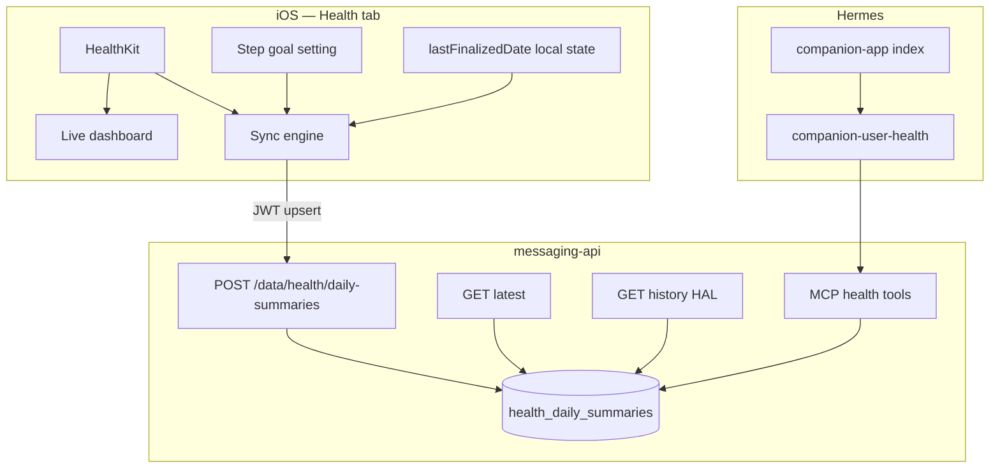

# Companion Health Vault — Design Overview

**Date:** 2026-06-17  
**Status:** Approved  
**Plans:**
- `docs/superpowers/plans/2026-06-17-companion-health-vault-backend.md` — **this repo**
- `docs/superpowers/plans/2026-06-17-companion-health-vault-ios.md` — **reference only; `assistant-companion` repo**  
**OpenAPI:** `docs/superpowers/specs/messaging-api.openapi.yaml` (v2.0.0)  
**Supersedes:** HealthKit out-of-scope note in `docs/history/specs/2026-06-13-companion-user-data-vault-design.md`

Split specs:

| Spec | Scope | Agent |
|------|-------|-------|
| [`2026-06-17-companion-health-vault-backend-design.md`](2026-06-17-companion-health-vault-backend-design.md) | `messaging-api`, MCP tools, `companion-user-health` skill, OpenAPI | This workspace (`hermes`) |
| [`2026-06-17-companion-health-vault-ios-design.md`](2026-06-17-companion-health-vault-ios-design.md) | Health tab, HealthKit, sync, step goal UI | `assistant-companion` (separate repo) |

---

## Goal

Add a **Health** surface to the companion app and extend the user data vault with **daily activity summaries** from HealthKit. The user sees live stats as the day progresses. Hermes answers specific questions — "how many steps today?", "how many steps left to hit my goal?" — via MCP + a data skill.

Location established the vault pattern; health adapts it for **calendar-day aggregates** instead of GPS event streams.

---

## Principles

| Principle | Detail |
|-----------|--------|
| **App owns HealthKit** | Only iOS reads HealthKit; API is dumb storage |
| **No midnight jobs** | Finalization happens on the **next sync** after a day ends |
| **Multi-day catch-up** | If the app is closed for days, one sync finalizes **each gap day** then upserts today |
| **Cumulative totals** | Each sync sends HealthKit **day-to-date totals**, not deltas |
| **User step goal** | Set in the Health tab; sent with every upsert |
| **Ring goals** | Move / exercise / stand from `HKActivitySummary` when available |

---

## Architecture



Chat and vault data never cross at runtime (same boundary as location).

---

## Shared data model — one row per local calendar day

Unique key: `(user_id, date)` where `date` is `YYYY-MM-DD` in the user's local timezone.

```json
{
  "id": "uuid",
  "date": "2026-06-17",
  "timezone": "Europe/Lisbon",
  "partial": true,
  "finalized_at": null,
  "synced_at": "2026-06-17T14:30:00.000Z",
  "source": "healthkit",
  "metrics": {
    "steps": {
      "value": 6432,
      "unit": "count",
      "goal": 10000,
      "remaining": 3568
    },
    "distance_walking_running": {
      "value": 4800,
      "unit": "m",
      "goal": null,
      "remaining": null
    },
    "active_energy": {
      "value": 312,
      "unit": "kcal",
      "goal": 500,
      "remaining": 188
    },
    "exercise_minutes": {
      "value": 22,
      "unit": "min",
      "goal": 30,
      "remaining": 8
    },
    "stand_hours": {
      "value": 6,
      "unit": "h",
      "goal": 12,
      "remaining": 6
    }
  }
}
```

### `partial` semantics

| Value | Meaning |
|-------|---------|
| `true` | **Current local calendar day** — totals still in progress |
| `false` | **Completed calendar day** — finalized on first sync after that day ended |

### Goal / remaining rules

- **`goal`** — target for the metric; `null` when unknown.
- **`remaining`** — `max(0, goal − value)` when `goal` is set; else `null`.
- **Steps goal** — user setting from Health tab (iOS).
- **Move / exercise / stand goals** — from `HKActivitySummary` when Watch summary exists; else `null`.

---

## Sync lifecycle (iOS-owned)

No server cron. No scheduled midnight task on device.

On **every sync** (foreground, background delivery, Health tab open):

```
today ← local calendar date (device timezone)
for date in (lastFinalizedDate + 1 day) ..< today:
    query HealthKit completed-day statistics for date
    POST upsert  { date, partial: false, metrics, ... }

query HealthKit for today (in progress)
POST upsert  { today, partial: true, metrics, ... }

lastFinalizedDate ← today - 1 day
```

**Multi-day gap example:** last sync Monday; user opens Saturday → finalize Tue–Fri (`partial: false`), upsert Sat (`partial: true`).

**Zero-activity days** still finalize (e.g. `steps: 0`) so history has no holes.

---

## v1 metrics

| Metric key | HealthKit quantity | Goal source |
|------------|-------------------|-------------|
| `steps` | `stepCount` | User setting (Health tab) |
| `distance_walking_running` | `distanceWalkingRunning` | Optional later; `null` in v1 |
| `active_energy` | `activeEnergyBurned` | Activity summary move goal |
| `exercise_minutes` | `appleExerciseTime` | Activity summary exercise goal |
| `stand_hours` | `appleStandHour` (count of hours stood) | Activity summary stand goal |

---

## Hermes question coverage

| User question | MCP field |
|---------------|-----------|
| "How many steps today?" | `metrics.steps.value` |
| "How many steps to hit my goal?" | `metrics.steps.remaining` |
| "How far did I walk?" | `metrics.distance_walking_running` |
| "Exercise ring progress?" | `metrics.exercise_minutes` |
| "Did I close stand?" | `metrics.stand_hours.remaining === 0` (when goal set) |

MCP tools and `companion-user-health` skill — see backend spec.

---

## Out of scope (v1)

- Heart rate samples, sleep sessions, workout list
- Intraday event log (per-sync history)
- Server-side finalization or timezone inference without client
- Health tab charts / week-over-week UI (Hermes history is enough for chat)
- Batch ingest endpoint (sequential POSTs per gap day is fine for v1)

---

## Repository scope

| Artifact | Repo |
|----------|------|
| REST routes, SQLite, MCP, skill, OpenAPI | `hermes` |
| Health tab, HealthKit, sync engine, goal UI | `assistant-companion` |

---

