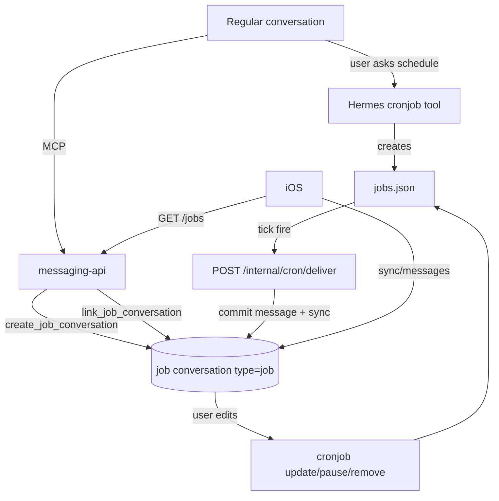

# Companion Cron (Job Conversations) — Design Spec

**Date:** 2026-06-18  
**Status:** Approved  
**API version:** v2.3.0 (OpenAPI)  
**Plans:**
- `docs/superpowers/plans/2026-06-18-companion-cron-backend.md` — **this repo**
- `docs/superpowers/specs/2026-06-18-companion-cron-ios-design.md` — **reference only; `assistant-companion` repo**
- `docs/superpowers/plans/2026-06-18-companion-cron-ios.md` — **stub; iOS agent writes full plan**
**OpenAPI:** `docs/superpowers/specs/messaging-api.openapi.yaml`  
**Workspace rules:** `AGENTS.md` — companion- prefix, backend-only implementation, OpenAPI mandatory on contract changes

---

## Goal

Bring **Telegram-parity Hermes cron** to the companion app: create jobs from chat (“remind me in 30m”, “every day at 9am”), manage them in a **jobs list**, and run each job in its own **job conversation** (`type: job`) where creation, config edits, and run outputs all live in one thread.

**Scheduler:** Hermes `jobs.json` + gateway tick (unchanged).  
**Delivery:** Hermes fires → HTTP webhook → `messaging-api` commits assistant message into the linked job conversation + sync event.  
**Push:** out of scope v1.

---

## Repository scope

| Artifact | Where | Implemented here? |
|----------|-------|-------------------|
| `GET /jobs`, conversation `type`, webhook handler | `messaging-api/` | **Yes** |
| MCP `create_job_conversation`, `link_job_conversation` | `messaging-api/` | **Yes** |
| `companion-cron` skill | `data/skills/` | **Yes** |
| `companion-app` routing row | `data/skills/` | **Yes** |
| OpenAPI v2.3.0 | `docs/superpowers/specs/` | **Yes** |
| Hermes `cronjob` tool usage / deliver config | Hermes runtime (`data/cron/`, operator docs) | **Operator config only** |
| iOS jobs UI / navigation | `assistant-companion` | **No** — see iOS design spec |

---

## Architecture



---

## Conversation model

### `conversations.kind`

| Value | Meaning |
|-------|---------|
| `regular` | Default user chat (existing behavior) |
| `job` | One Hermes cron job; thread holds create confirmation, config chat, run outputs |

### Job conversation columns (API DB)

| Column | Type | Notes |
|--------|------|-------|
| `kind` | `regular` \| `job` | Default `regular` |
| `hermes_job_id` | text, nullable | Set by `link_job_conversation`; unique when not null |
| `schedule_display` | text, nullable | Human schedule from Hermes (e.g. `30 9 * * *`) |
| `job_enabled` | integer (bool) | Cached; default 1 |
| `job_last_run_at` | text, nullable | Updated on webhook |
| `job_last_status` | text, nullable | `ok` \| `error` \| null |

Job conversations use a **dedicated bootstrap** (stored like `bootstrap_prompt`) instructing Hermes to load `companion-cron` + `companion-app`.

---

## Flows

### Create (from regular conversation)

1. User requests a schedule in a **regular** conversation.
2. Agent loads `companion-cron` (via `companion-app` routing).
3. Agent calls MCP `create_job_conversation({ name, schedule_display })` → `conversation_id`.
4. Agent calls `cronjob(action=create, schedule, prompt, deliver=…)` → `hermes_job_id`.
5. Agent calls MCP `link_job_conversation({ conversation_id, hermes_job_id, schedule_display })`.
6. Agent replies in **regular** conversation with `conversation_id` and `hermes_job_id` (no navigation/link semantics — iOS handles presentation).
7. Agent posts initial summary message into **job** conversation (via normal message path or webhook seed — implementation uses first assistant commit in job conv after link).

**Hermes job `deliver`:** `webhook:http://messaging-api:3000/internal/cron/deliver` (Docker internal URL; operator-synced).

**Hermes job `origin` (via `cronjob` update after link):**

```json
{
  "platform": "companion",
  "user_id": "<uuid>",
  "conversation_id": "<uuid>",
  "hermes_job_id": "<hex>"
}
```

### Edit (in job conversation)

User chats in the job thread → agent uses `cronjob` `list` / `update` / `pause` / `resume` / `remove` scoped to that conversation's `hermes_job_id`. API caches schedule/enabled changes when MCP `link_job_conversation` or a new `sync_job_from_hermes` MCP tool is called (v1: update cache on link + webhook only).

### On fire (webhook)

1. Hermes scheduler completes run.
2. POST ` /internal/cron/deliver` with bearer `CRON_WEBHOOK_BEARER`.
3. API resolves job conversation by `hermes_job_id`.
4. If `content` trimmed uppercases to `[SILENT]` → `204`, no message.
5. Else commit assistant `Message`, append `message_upsert` sync event, update `job_last_run_at` / `job_last_status`.
6. Return `200 { message_id }`.

### Jobs list

`GET /jobs` — HAL list of the user's `kind=job` conversations with job metadata (see OpenAPI). Distinct from `GET /conversations` so the client can build a jobs index without filtering.

---

## Hermes integration

### Delivery target

Use Hermes cron `deliver` with first-colon split semantics:

```
webhook:http://messaging-api:3000/internal/cron/deliver
```

**Spike required during implementation:** confirm Hermes outbound webhook POST body shape. Handler accepts:

- **Preferred JSON** (if Hermes can send structured payload): `{ hermes_job_id, content, run_at, status }`
- **Fallback plain text:** body = message content; `hermes_job_id` from query `?job_id=` appended to deliver URL by agent at create time:

```
webhook:http://messaging-api:3000/internal/cron/deliver?job_id=<hex>
```

### Operator env (`.env`)

```dotenv
CRON_WEBHOOK_BEARER=<long-random>
```

`messaging-api` validates `Authorization: Bearer <CRON_WEBHOOK_BEARER>` on internal route. Not a JWT; not exposed to mobile clients.

### Parity features (v1)

| Telegram cron | Companion v1 |
|---------------|--------------|
| `cronjob` create/list/update/pause/resume/remove/run | Yes (Hermes tool in both regular + job convs) |
| Recurring + one-shot schedules | Yes |
| `[SILENT]` suppression | Yes (webhook → 204) |
| `enabled_toolsets` on job | Yes (Hermes job fields) |
| `context_from` chaining | Yes (Hermes-native) |
| `no_agent` script jobs | Yes (Hermes-native; deliver via webhook) |
| Push notification | **No** v1 |
| `cron.wrap_response` | N/A — API stores raw content |

---

## MCP tools (companion MCP, bearer auth)

Not in OpenAPI. Mirror REST semantics where applicable.

### `create_job_conversation`

**Input:** `{ name: string, schedule_display?: string }`  
**Output:** `{ conversation_id, kind: "job" }`  
Creates job conversation + job bootstrap for authenticated user (from MCP session / Hermes operator context).

### `link_job_conversation`

**Input:** `{ conversation_id, hermes_job_id, schedule_display?: string, job_enabled?: boolean }`  
**Output:** `{ conversation_id, hermes_job_id }`  
Sets `hermes_job_id` on job conversation; rejects if already linked or conversation not `kind=job`.

---

## Skills

### New: `companion-cron`

- Create flow (MCP + `cronjob` ordering)
- Job-conversation edit commands
- `[SILENT]` prompt guidance for monitoring jobs
- `deliver` URL + `job_id` query param pattern
- Reply in regular conv: return IDs only

### Update: `companion-app`

Add routing row: deferred schedules / cron / job management → `companion-cron`.

---

## Sync / API surface

- `Conversation.kind`, job metadata fields on GET conversation/list/sync upserts
- `GET /jobs` — job-only HAL list
- `POST /internal/cron/deliver` — **internal only**, not in OpenAPI

---

## Out of scope (v1)

- Push notifications
- iOS UX / navigation (see iOS design spec)
- Creating jobs from jobs list without chat (API-only create) — future
- Cross-device live SSE for cron fires (sync only)
- Replacing Hermes scheduler with API-owned ticker

---

## Testing (backend)

- Webhook auth, silent suppression, message commit + sync event
- `create_job_conversation` / `link_job_conversation` MCP
- `GET /jobs` HAL pagination
- `kind=job` on conversation GET/list/sync
- Job conversation isolated from regular list filters (jobs endpoint only)