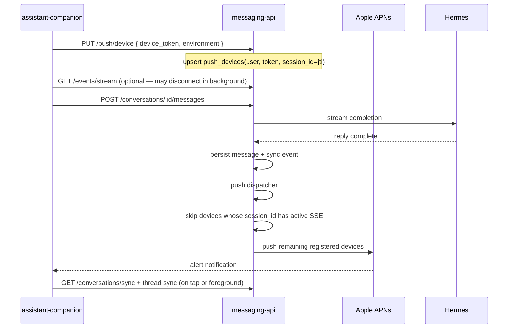

# Companion Push Notifications — Backend Design Spec

**Date:** 2026-06-19  
**Status:** Approved
**API version:** v2.5.0 (OpenAPI)  
**OpenAPI:** `docs/superpowers/specs/messaging-api.openapi.yaml`  
**Consumer:** `assistant-companion` (iOS)  
**Related specs:** `docs/superpowers/specs/2026-06-18-companion-session-stream-design.md`, `docs/superpowers/specs/2026-06-17-companion-chat-local-sync-backend-design.md`, `docs/superpowers/specs/2026-06-18-companion-cron-design.md`  
**Status:** Parked (requires paid Apple Developer program)  
**Backend plan:** `docs/history/parked/push/2026-06-19-companion-push-backend.md`  
**iOS reference:** `docs/history/parked/push/2026-06-19-companion-push-ios-design.md`

---

## Confirmed product decisions

| # | Decision |
|---|----------|
| 1 | **Triggers:** assistant reply committed **and** cron output delivered (non-`[SILENT]`). No run errors, title-only, or sync-without-message. |
| 2 | **Body:** message preview (~120 chars, plain-text strip). |
| 3 | **Background sending device:** push when that device's session has **no** active SSE subscriber. |
| 4 | **Recipients:** push to **all** registered devices for the user **except** any device whose `session_id` currently has an active `GET /events/stream` subscriber. |
| 5 | **Job vs chat routing:** different alert title and tap destination — see § APNs payload. Chat push opens the message thread; cron push opens the **jobs** surface (not the job thread). |
| 6 | **Badge:** none (`badge` omitted). |
| 7 | **Mute:** none server-side; user may disable notifications in iOS Settings. |
| 8 | **Silent push:** **no** (confirmed) — alert notifications only; sync on tap or foreground. |
| 9 | **Coalescing:** one push per committed message. |
| 10 | **APNs setup:** **TODO** — Apple Developer key + bundle id not provisioned yet. Backend ships with `APNS_ENABLED=false` until operator completes § Operator checklist. |


## Goal

Add **APNs alert push** so the companion app can notify the user when a new assistant message is committed while they are not watching the live session SSE — including backgrounded sending device and other logged-in devices.

Push is a **wake-up signal**. Durable message truth remains sync feeds + HAL history. The client opens the app (or foregrounds), syncs, and renders committed messages.

---

## Non-goals (v1)

- Android / FCM
- Web push
- Rich notifications (images, actions, categories)
- Server-side notification preferences or per-conversation mute
- Silent background sync push
- Push for in-flight streaming tokens (SSE only)
- Replacing sync or SSE

---

## Architecture



### Three transport roles (unchanged)

| Layer | Route | Role with push |
|-------|-------|----------------|
| **Session SSE** | `GET /events/stream` | Live in-flight UX; **suppresses push to origin session when connected** |
| **Sync** | `GET /conversations/sync`, `GET /conversations/{id}/sync` | Client loads committed message after notification |
| **Push** | APNs (new) | Alert user that sync has new data |

---

## Decisions

| Topic | Choice |
|-------|--------|
| Provider | Apple APNs (HTTP/2, token-based auth) |
| Registration | Client-driven `PUT /push/device` after APNs grants permission |
| Token scope | One row per `device_token` (globally unique); upsert on re-register |
| Session link | Store JWT `jti` as `session_id` at register time |
| Logout | Client calls `DELETE /push/device` (best effort); server does not auto-delete on `POST /auth/logout` v1 |
| Send timing | Fire-and-forget after DB commit; never block run completion |
| APNs disabled | `APNS_ENABLED=false` → dispatcher no-ops (local dev default) |
| Invalid token | APNs `410` / `Unregistered` → delete `push_devices` row |
| Internal routes | None — push is server-initiated only |

---

## SQLite schema

### New table: `push_devices`

```sql
CREATE TABLE push_devices (
  id TEXT PRIMARY KEY,
  user_id TEXT NOT NULL,
  device_token TEXT NOT NULL,
  platform TEXT NOT NULL DEFAULT 'ios' CHECK (platform IN ('ios')),
  environment TEXT NOT NULL CHECK (environment IN ('development', 'production')),
  session_id TEXT,
  created_at TEXT NOT NULL DEFAULT (datetime('now')),
  updated_at TEXT NOT NULL DEFAULT (datetime('now')),
  FOREIGN KEY (user_id) REFERENCES users(id) ON DELETE CASCADE
);

CREATE UNIQUE INDEX push_devices_device_token_idx ON push_devices (device_token);
CREATE INDEX push_devices_user_id_idx ON push_devices (user_id);
```

- `session_id`: JWT `jti` from the register request; used to skip push when that session has live SSE.
- Re-login on same physical device: same `device_token`, new `session_id` — upsert updates `session_id` and `updated_at`.

---

## Configuration

| Env var | Required when `APNS_ENABLED=true` | Notes |
|---------|-----------------------------------|-------|
| `APNS_ENABLED` | No | Default `false` |
| `APNS_TEAM_ID` | Yes | Apple Developer team ID |
| `APNS_KEY_ID` | Yes | APNs key id (`.p8` key) |
| `APNS_BUNDLE_ID` | Yes | iOS app bundle id (topic) |
| `APNS_KEY_PATH` | Yes* | Path to `.p8` inside container (e.g. `/opt/data/apns/AuthKey_XXX.p8`) |
| `APNS_ENVIRONMENT` | Yes | `development` or `production` — must match client build + registered `environment` |
| `PUSH_PREVIEW_MAX_CHARS` | No | Default `120` |

\* Alternative: `APNS_KEY_PEM` inline for small deployments; plan uses file path mounted via `data/`.

Mount `.p8` under `data/` (gitignored); document in `README.md`.

---

## REST API (v2.5.0)

### `PUT /push/device`

Register or refresh a device token for the authenticated user.

**Auth:** JWT  
**Body:**

```json
{
  "device_token": "64-char hex",
  "environment": "development"
}
```

| Field | Rules |
|-------|-------|
| `device_token` | Required; 64 hex chars (APNs device token) |
| `environment` | Required; `development` \| `production` |

**Behavior:**

- Upsert by `device_token` (global). If token exists for another `user_id`, reassign to current user (device changed accounts).
- Set `session_id` from JWT `jti`.
- `200` + `{ "ok": true }`

**Errors:** `400` validation, `401` unauthenticated.

### `DELETE /push/device`

Unregister the device token (logout or user disabled notifications).

**Auth:** JWT  
**Body:** `{ "device_token": "..." }`  
**Response:** `200 { "ok": true }` — idempotent if token unknown.

---

## APNs payload

Alert notification with custom companion metadata for tap routing.

### Chat message (`assistant_reply`)

```json
{
  "aps": {
    "alert": {
      "title": "Morning briefing",
      "body": "Here is your schedule for today…"
    },
    "sound": "default",
    "thread-id": "<conversationId>"
  },
  "companion": {
    "destination": "conversation",
    "conversation_id": "<uuid>",
    "message_id": "<uuid>",
    "kind": "assistant_reply"
  }
}
```

| Field | Value |
|-------|-------|
| `aps.alert.title` | `conversation.title ?? 'New message'` |
| `aps.alert.body` | preview of message content |
| `companion.destination` | `conversation` |
| iOS tap | Open that conversation thread; sync; scroll to `message_id` if feasible |

### Cron / job fire (`cron_run`)

```json
{
  "aps": {
    "alert": {
      "title": "Job · Morning check-in",
      "body": "Weather is clear, 18°C…"
    },
    "sound": "default",
    "thread-id": "jobs"
  },
  "companion": {
    "destination": "jobs",
    "conversation_id": "<jobConversationUuid>",
    "message_id": "<uuid>",
    "kind": "cron_run"
  }
}
```

| Field | Value |
|-------|-------|
| `aps.alert.title` | `Job · {conversation.title ?? schedule_display ?? 'Scheduled job'}` |
| `aps.alert.body` | preview of run output |
| `aps.thread-id` | literal `jobs` (groups job alerts separately from chat threads in Notification Center) |
| `companion.destination` | `jobs` |
| `companion.conversation_id` | job conversation id (for sync context; **not** the tap target screen) |
| iOS tap | Open **jobs list** (`GET /jobs` surface), not the job conversation thread |

| `companion.kind` | When | `destination` |
|------------------|------|---------------|
| `assistant_reply` | `executeAssistantRun` committed assistant message | `conversation` |
| `cron_run` | `deliverCronRun` committed non-silent output | `jobs` |

**Preview helper:** `stripPushPreview(content)` — trim, collapse whitespace, truncate to `PUSH_PREVIEW_MAX_CHARS`, append `…` if truncated.

**Title helpers:**

- `buildChatPushTitle(title)` → `title?.trim() || 'New message'`
- `buildJobPushTitle(title, scheduleDisplay)` → `` `Job · ${title?.trim() || scheduleDisplay?.trim() || 'Scheduled job'}` ``

---

## Push dispatcher

### `notifyCommittedAssistantMessage`

Called from `run-executor` after `persistCompletedRun` + before/after `publishReplyDone` (order: after commit, async).

**Input:** `userId`, `conversationId`, `messageId`, `content`, `conversationTitle`, `originSessionId`

**Recipient selection (shared by both notify functions):**

```
devices = listPushDevices(userId)

for device in devices:
  if device.session_id && hub.hasSessionListener(device.session_id):
    skip  // device has live SSE — user is "online" on that phone
  else:
    enqueue push
```

Covers: backgrounded sending device (no SSE), other logged-in devices, and cron fires.

### `notifyCommittedCronMessage`

Called from `deliverCronRun` after `emitConversationMessageUpsert`.

**Input:** `userId`, `conversationId`, `messageId`, `content`, `conversationTitle`, `scheduleDisplay?`

**Payload:** `kind: cron_run`, `destination: jobs`, job title format (§ APNs payload).

### Delivery

- `ApnsClient.send(deviceToken, environment, payload)` — HTTP/2 to `api.sandbox.push.apple.com` or `api.push.apple.com`.
- JWT auth: ES256, `iss` = team id, `iat`, header `kid` = key id; TTL ≤ 60 min (refresh per send batch).
- Errors: log non-410 failures; delete row on 410.
- `APNS_ENABLED=false`: return immediately.

---

## Code touchpoints

| Unit | Change |
|------|--------|
| `src/db/schema.ts` | `push_devices` table + migration |
| `src/db/repos/push-devices.ts` | upsert, delete, listByUserId |
| `src/routes/push.ts` | `PUT` / `DELETE /push/device` |
| `src/routes/index.ts` | register push routes |
| `src/config.ts` | APNs env parsing |
| `src/lib/push-preview.ts` | preview + title helpers |
| `src/services/apns-client.ts` | HTTP/2 APNs sender |
| `src/services/push-dispatcher.ts` | recipient logic + async send |
| `src/streams/hub.ts` | `hasSessionListener(sessionId): boolean` |
| `src/services/run-executor.ts` | call dispatcher after persist |
| `src/db/repos/cron-deliver.ts` | call dispatcher after deliver |
| `docs/superpowers/specs/messaging-api.openapi.yaml` | v2.5.0 |
| `.env.example` | APNs vars |
| `README.md` | operator setup (key mount, enable flag) |

---

## StreamHub extension

```typescript
hasSessionListener(sessionId: string): boolean {
  return this.sessionListeners.has(sessionId)
}
```

Used only for push suppression — not a guarantee the iOS app is foregrounded, but correlates with an open SSE connection.

---

## Testing (backend)

| Area | Cases |
|------|-------|
| `PUT /push/device` | upsert, validation, session_id stored, cross-user token reassignment |
| `DELETE /push/device` | removes row, idempotent |
| Preview helper | truncate, whitespace, empty |
| Dispatcher | skips any device with active SSE on its `session_id`; sends to all others |
| Cron deliver | push enqueued on deliver; silent → no push |
| APNs client | mock HTTP/2; 410 deletes token |
| `APNS_ENABLED=false` | no network calls |

Use injectable `ApnsClient` interface in tests (fake records sends).

---

## Out of scope (future)

- `POST /auth/logout` auto-deletes all tokens for `session_id`
- Server-side notification preferences
- Badge / unread counts
- Push coalescing
- Silent `content-available` + background sync
- Webhook to Hermes for push analytics

---

## Operator checklist

**Status: TODO** — Apple Developer APNs key and bundle id not yet provisioned.

1. Create APNs key in Apple Developer portal; download `.p8`.
2. Place key at `data/apns/AuthKey_<KEY_ID>.p8` (gitignored).
3. Set `APNS_ENABLED=true`, team/key/bundle/env in `.env`.
4. Rebuild/restart `messaging-api`.
5. iOS TestFlight/dev build registers token with matching `environment`.

Until step 1–4 are done, push code can merge with `APNS_ENABLED=false` (no-op).