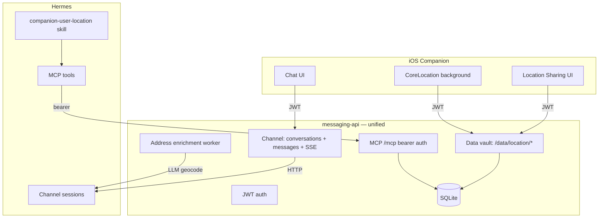

# Companion User Data Vault — Design Spec

**Date:** 2026-06-13  
**Status:** Approved  
**Plans:** `docs/history/plans/2026-06-13-companion-user-data-vault-backend.md`, `docs/history/plans/2026-06-13-companion-user-data-vault-ios.md`  
**OpenAPI:** `docs/superpowers/specs/messaging-api.openapi.yaml` (v1.5.0)  
**Supersedes:** conversation-scoped location in `docs/history/implemented/specs/2026-06-12-hermes-messaging-api-design.md` and `docs/history/implemented/specs/2026-06-12-hermes-assistant-companion-design.md` (location sections only)

---

## Goal

Evolve `messaging-api` into a unified companion backend with two Hermes integration surfaces:

1. **Channel** — chat persistence and streaming (unchanged in purpose)
2. **User data vault** — location and future sensor data, written by the iOS app and read by Hermes on demand via MCP + skills

Location is decoupled from conversations. The backend is a dumb vault (events + history). The app owns sharing policy. All Hermes channels (iOS companion, Telegram, CLI) read location from one MCP source.

---

## Out of Scope (v1)

- Dedicated geocoder API integration (planned later when API key is added)
- Full maps integration
- Push-notification location refresh from Telegram
- HealthKit or other sensor types (same pattern, later)
- Data retention pruning policy
- Multi-user MCP identity (single-operator bearer token for now)

---

## Architecture



Both surfaces share the same container, SQLite database, and user table. Chat and vault data never cross at runtime.

---

## Channel (unchanged purpose)

Existing routes remain for auth, conversations, messages, SSE, process stream, title generation, and message edit.

**Removed from channel:**

- `POST /conversations/:id/location`
- `GET /conversations/:id/location/latest`
- `DELETE /conversations/:id/location`
- `conversation_locations` table
- Silent location injection in `prompt-builder` / `run-executor`

---

## Data Vault — Location API

User-scoped via JWT `userId`. No `conversation_id`.

### Endpoints

```
POST /data/location/events      — append location event
GET  /data/location/latest      — newest event for authenticated user
GET  /data/location/events      — paginated history (?limit, ?before)
```

No server-side sharing mode endpoints. The app owns whether live sharing is enabled.

### Ingest payload

```json
{
  "lat": 38.7223,
  "lon": -9.1393,
  "accuracy_m": 12,
  "timestamp": "2026-06-13T10:00:00.000Z",
  "trigger": "manual",
  "source": "ios",
  "address": "Rua D Fernando I 41, Fernão Ferro, Portugal"
}
```

| Field | Required | Notes |
|-------|----------|-------|
| `lat`, `lon`, `accuracy_m`, `timestamp` | yes | `timestamp` must be ISO 8601 UTC with milliseconds |
| `trigger` | yes | `manual` \| `significant_change` \| `interval` |
| `source` | yes | `ios` for companion app |
| `address` | no | Set when iOS `CLGeocoder` succeeds |

### Data model

```sql
CREATE TABLE location_events (
  id            TEXT PRIMARY KEY,
  user_id       TEXT NOT NULL REFERENCES users(id),
  lat           REAL NOT NULL,
  lon           REAL NOT NULL,
  accuracy_m    REAL NOT NULL,
  timestamp     TEXT NOT NULL,
  trigger       TEXT NOT NULL,
  source        TEXT NOT NULL,
  address       TEXT,
  address_source TEXT,       -- ios | server
  address_status TEXT NOT NULL DEFAULT 'resolved',  -- resolved | pending | failed
  created_at    TEXT NOT NULL DEFAULT (datetime('now'))
);

CREATE INDEX idx_location_events_user_timestamp
  ON location_events (user_id, timestamp DESC);
```

**Latest** is derived: `ORDER BY timestamp DESC LIMIT 1` per user.

Every `POST` appends a row. History is kept indefinitely in v1; retention policy deferred.

### MCP read rule

- If a latest event exists → return it with computed freshness
- If no events exist → `{ "available": false }`
- Staleness does not hide data; the skill reports freshness honestly

---

## Geocoding

**Priority chain:**

1. **iOS `CLGeocoder`** — app includes `address` in POST when successful
2. **Backend fallback (v1)** — Hermes LLM reverse-geocode for events inserted with `address_status: pending`
3. **Backend fallback (later)** — dedicated geocoder when API key is configured
4. **Maps integration** — deferred

### Async enrichment

After `POST` without `address`:

1. Insert event with `address_status: pending`
2. Return `204` immediately
3. Background worker calls Hermes `POST /v1/chat/completions` with a dedicated session (not a user chat) and a tight prompt: return a single-line postal address for the coordinates
4. On success → update row: `address`, `address_source: server`, `address_status: resolved`
5. On failure → `address_status: failed` (coordinates remain valid)

For continuous sharing, skip re-geocoding when coordinates have not moved meaningfully (~100m) since the last resolved event.

Config hook for a future geocoder API key; implementation deferred.

---

## MCP Surface

### Auth

Single-user bearer token: `COMPANION_MCP_BEARER_TOKEN` in `.env`, same pattern as `apple-caldav-mcp`.

Hermes config:

```yaml
mcp_servers:
  companion:
    url: http://messaging-api:3000/mcp
    headers:
      Authorization: "Bearer <COMPANION_MCP_BEARER_TOKEN>"
```

### Tools (v1)

#### `get_user_location`

Returns the latest event for the operator, or unavailability.

```json
{
  "available": true,
  "lat": 38.7223,
  "lon": -9.1393,
  "accuracy_m": 12,
  "address": "Rua D Fernando I 41, Fernão Ferro, Portugal",
  "address_status": "resolved",
  "timestamp": "2026-06-13T10:00:00.000Z",
  "trigger": "significant_change",
  "freshness": "12 min ago"
}
```

```json
{ "available": false }
```

#### `get_location_history`

Paginated event log.

Parameters: `limit` (default 20, max 100), `before` (optional event id or timestamp cursor).

---

## Hermes Skill — `companion-user-location`

Single skill for all channels. The companion vault is the only location source.

### Triggers

- "where am I?", coordinates, address, map links
- Travel, maps, weather-near-me, or any task needing the user's position
- "where was I …?" → use `get_location_history`

### Workflow

1. Call `get_user_location` via companion MCP
2. If `available: false` → tell the user location is not available; suggest sharing from the companion app
3. If `available: true` → respond in the fixed four-line format:
   ```
   Address: ...
   Coordinates: lat, lon
   Accuracy: Xm
   Updated: 12 min ago
   ```
   Optional Apple Maps link. Compact; no extra prose.
4. If `address_status: pending` → show coordinates and accuracy; omit address or note it is resolving
5. **Never** call Home Assistant for location

### Channel behavior

| Channel | Writes to vault | Reads location |
|---------|----------------|----------------|
| iOS companion | Yes | skill → MCP |
| Telegram | No | skill → MCP |
| CLI / dashboard | No | skill → MCP |

Telegram does not ingest location. It reads whatever the app last shared. If the app has not posted recently, the skill reports last-known with staleness or unavailability.

### Removed skills and paths

- Delete `data/skills/smart-home/roberto-location-source/`
- Delete `generic-location-refresh` skill if present
- Drop HA `request_location_update` from location answers
- Drop `conversation_locations` and prompt injection (see Channel section)

---

## iOS App Changes

The companion app is implemented on a separate machine. These changes apply to that codebase.

### Structure

Location becomes a standalone feature, not part of chat.

| Remove | Replace with |
|--------|-------------|
| Location mode picker in `MessageComposer` | `LocationSharingView` |
| `POST /conversations/:id/location` | `POST /data/location/events` |
| `DELETE /conversations/:id/location` | Stop posting locally (no API call) |
| `mode: once/live` in payload | `trigger: manual/significant_change/interval` |

### Case 1: One-off share

User taps **Share now**:

1. `CLLocationManager.requestLocation`
2. `CLGeocoder` → optional `address`
3. `POST /data/location/events` with `trigger: manual`
4. Brief confirmation in UI

No conversation involved. No message send required.

### Case 2: Continuous background sharing

User toggles **Share live location** (app-local state only):

1. `startMonitoringSignificantLocationChanges()`
2. Optional timer fallback (interval decided by app, not server)
3. On each fix: skip if coords unchanged (~100m); geocode; `POST` with `trigger: significant_change` or `interval`
4. Persistent indicator while enabled
5. On disable: stop `CLLocationManager`; no server call

**Permissions:** `NSLocationAlwaysAndWhenInUseUsageDescription` and background mode `location` required for continuous sharing.

### Geocoding on device

App always attempts `CLGeocoder` before POST. Include `address` when successful; omit when not. Do not wait for backend enrichment.

---

## Migration

1. Add `location_events` table and `/data/location/*` routes
2. Add `/mcp` endpoint with bearer auth and tools
3. Add address enrichment worker
4. Remove conversation location routes, table, and prompt injection
5. Register companion MCP in `data/config.yaml`
6. Add `companion-user-location` skill; delete HA location skills
7. Update iOS app on separate machine per iOS section above
8. Add `COMPANION_MCP_BEARER_TOKEN` to `.env.example`

No data migration from `conversation_locations` — location was conversation-scoped and is being replaced by a user-scoped model.

---

## Error Handling

| Case | Behavior |
|------|----------|
| Invalid location payload | `400 invalid_request` |
| Unauthorized ingest/read | `401` |
| MCP missing bearer token | `401` |
| No location events for user | MCP returns `available: false` |
| Geocoding enrichment fails | Event kept with coords; `address_status: failed` |
| Hermes MCP unreachable | Skill reports location lookup failed |

---

## Testing

**Backend:**

- `POST /data/location/events` — valid/invalid payloads, with and without address
- `GET /data/location/latest` — returns newest; 404 or empty when none
- `GET /data/location/events` — pagination
- Address enrichment worker — pending → resolved / failed
- MCP `get_user_location` — available and unavailable cases
- MCP `get_location_history` — limit and cursor
- MCP bearer auth — reject missing/invalid token
- Confirm `run-executor` no longer injects location
- Confirm conversation delete does not reference location table

**Skill:**

- Location question routes to `companion-user-location`, not HA skills
- Four-line format on available response
- Unavailable message when vault is empty

---

## Future Extensions

Same vault pattern for additional data types:

```
/data/<type>/events
/data/<type>/latest
MCP: get_user_<type>
```

Examples: HealthKit steps, heart rate, motion. Each type gets its own ingest routes and MCP tool; skills decide when to fetch.

When a geocoder API key is added, enrichment worker prefers it over Hermes LLM. Maps integration discussed separately.