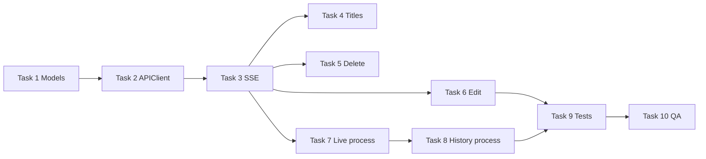

# Assistant Companion — Backend Parity Implementation Plan

> **For agentic workers:** REQUIRED SUB-SKILL: Use superpowers:subagent-driven-development (recommended) or superpowers:executing-plans to implement this plan task-by-task. Steps use checkbox (`- [ ]`) syntax for tracking.

**Goal:** Bring the iOS `assistant-companion` app to parity with messaging-api **v1.4.0** — conversation titles, deletion, message edit, and the two-phase assistant process stream.

**Architecture:** Extend the existing SwiftUI app from `2026-06-12-assistant-companion-plan.md` with typed models, a unified `SSEEvent` enum, and ViewModel-driven state. Conversation list owns title/delete/rename; `ChatViewModel` owns stream handling (`process` → `process_complete` → `token`), rewind on edit, and historical collapsible process blocks.

**Tech Stack:** SwiftUI, Swift Concurrency, URLSession, XCTest

**Prerequisite:** Base app implemented per `docs/superpowers/plans/2026-06-12-assistant-companion-plan.md` (auth, list, chat, location, basic SSE `token`/`done`).

**Backend specs:**
- `docs/superpowers/specs/2026-06-13-conversation-title-generation-design.md`
- `docs/superpowers/specs/2026-06-13-message-edit-design.md`
- `docs/superpowers/specs/2026-06-13-assistant-process-stream-design.md`
- `docs/superpowers/specs/messaging-api.openapi.yaml` (v1.4.0)

**App root (assumed):** `assistant-companion/assistant-companion/`

---

## Backend → FE feature map

| Backend (API v1.x) | FE work |
|--------------------|---------|
| v1.1 `title: null`, SSE `title`, `PATCH /conversations/:id` | Nullable titles, live title update, rename UI |
| v1.2 `DELETE /conversations/:id` | Swipe/context delete, 409 handling |
| v1.3 `PATCH /messages/:id`, SSE `rewind` | Edit latest user message, remove assistant + process from UI |
| v1.4 SSE `process`, `process_complete`, `Message.process` | Live process bubble + collapsed history per assistant turn |

---

## File structure (new / modified)

```
assistant-companion/assistant-companion/
  Models/
    Conversation.swift          — MODIFY: title String?
    Message.swift                 — MODIFY: optional MessageProcess
    ProcessLine.swift             — NEW
    SSEEvent.swift                — NEW: typed stream events
  Services/
    APIClient.swift               — MODIFY: patch, deleteConversation, editMessage
    SSEParser.swift               — MODIFY: decode all event payloads
  ViewModels/
    ConversationListViewModel.swift — MODIFY: delete, rename, displayTitle helper
    ChatViewModel.swift           — MODIFY: full SSE + edit + process state
  Views/
    ConversationListView.swift    — MODIFY: swipe delete, rename sheet
    ChatView.swift                — MODIFY: process UI, edit affordance, dynamic title
    MessageBubble.swift           — MODIFY: assistant + collapsible process
    ProcessBubble.swift           — NEW: live + historical process block
    MessageComposer.swift         — MODIFY: edit mode vs send mode
assistant-companion/assistant-companionTests/
    SSEEventDecodingTests.swift   — NEW
    ProcessLineTests.swift        — NEW (optional)
    ChatViewModelSSETests.swift   — NEW: stream state machine tests
    ConversationListViewModelTests.swift — MODIFY
```

---

## Phase 1 — Models & API client

### Task 1: Process and message models

**Files:**
- Create: `Models/ProcessLine.swift`
- Modify: `Models/Message.swift`
- Modify: `Models/Conversation.swift`
- Create: `assistant-companionTests/SSEEventDecodingTests.swift` (payload fixtures only for now)

- [ ] **Step 1: Create ProcessLine.swift**

```swift
import Foundation

enum ProcessLineKind: String, Codable {
    case reasoning
    case tool
}

struct ProcessLine: Codable, Equatable, Identifiable {
    var id: String { "\(kind.rawValue)-\(text)" }
    let kind: ProcessLineKind
    let text: String
}

struct MessageProcess: Codable, Equatable {
    let lines: [ProcessLine]
}
```

- [ ] **Step 2: Update Message.swift**

```swift
import Foundation

struct Message: Codable, Identifiable, Equatable {
    let id: String
    let conversation_id: String
    let role: String
    let content: String
    let created_at: String
    let process: MessageProcess?

    var isUser: Bool { role == "user" }
    var isAssistant: Bool { role == "assistant" }
}
```

Use explicit `CodingKeys` only if the project already uses snake_case conversion via `JSONDecoder.keyDecodingStrategy = .convertFromSnakeCase`. If not, add:

```swift
enum CodingKeys: String, CodingKey {
    case id, role, content, process
    case conversation_id, created_at
}
```

- [ ] **Step 3: Update Conversation.swift — nullable title**

```swift
struct ConversationSummary: Codable, Identifiable, Equatable {
    let id: String
    let title: String?
    let hermes_session_id: String
    let created_at: String

    func displayTitle(dateFormatter: DateFormatter = ConversationSummary.fallbackDateFormatter) -> String {
        if let title = title?.trimmingCharacters(in: .whitespacesAndNewlines), !title.isEmpty {
            return title
        }
        return dateFormatter.string(from: Self.parsedDate(created_at) ?? Date())
    }

    private static func parsedDate(_ raw: String) -> Date? {
        let sqlite = DateFormatter()
        sqlite.dateFormat = "yyyy-MM-dd HH:mm:ss"
        sqlite.timeZone = .current
        if let d = sqlite.date(from: raw) { return d }
        return ISO8601DateFormatter().date(from: raw)
    }

    static let fallbackDateFormatter: DateFormatter = {
        let f = DateFormatter()
        f.dateStyle = .medium
        f.timeStyle = .short
        return f
    }()
}
```

- [ ] **Step 4: Commit**

```bash
git add assistant-companion/assistant-companion/Models/
git commit -m "feat(companion): add process models and nullable conversation titles"
```

---

### Task 2: APIClient — PATCH, DELETE, edit message

**Files:**
- Modify: `Services/APIClient.swift`
- Modify: `assistant-companionTests/APIClientTests.swift` (or create)

- [ ] **Step 1: Add generic PATCH and void DELETE helpers**

```swift
func patch<Body: Encodable, Response: Decodable>(
    _ path: String,
    body: Body
) async throws -> Response {
    let req = try request(path: path, method: "PATCH", body: body)
    let (data, response) = try await session.data(for: req)
    try validate(response: response, data: data)
    return try decoder.decode(Response.self, from: data)
}

func deleteVoid(_ path: String) async throws {
    let req = try request(path: path, method: "DELETE")
    let (data, response) = try await session.data(for: req)
    try validate(response: response, data: data)
}
```

Ensure `validate` treats `204 No Content` as success with empty body.

- [ ] **Step 2: Add conversation + message endpoints**

```swift
struct UpdateConversationBody: Encodable {
    let title: String
}

func updateConversationTitle(id: String, title: String) async throws -> ConversationSummary {
    try await patch("/conversations/\(id)", body: UpdateConversationBody(title: title))
}

func deleteConversation(id: String) async throws {
    try await deleteVoid("/conversations/\(id)")
}

struct EditMessageBody: Encodable {
    let text: String
}

struct SendMessageResponse: Decodable {
    let message: Message
}

func editMessage(conversationId: String, messageId: String, text: String) async throws -> SendMessageResponse {
    try await patch(
        "/conversations/\(conversationId)/messages/\(messageId)",
        body: EditMessageBody(text: text)
    )
}
```

- [ ] **Step 3: Fix create conversation — stop sending client-side title**

`POST /conversations` has no body. Remove any `Body(title:)` from `create()`; backend returns `title: null`.

- [ ] **Step 4: Commit**

```bash
git add assistant-companion/assistant-companion/Services/APIClient.swift
git commit -m "feat(companion): add PATCH/DELETE conversation and message edit APIs"
```

---

## Phase 2 — Typed SSE layer

### Task 3: SSEEvent enum + parser

**Files:**
- Create: `Models/SSEEvent.swift`
- Modify: `Services/SSEParser.swift`
- Create: `assistant-companionTests/SSEEventDecodingTests.swift`

- [ ] **Step 1: Write decoding tests**

```swift
import XCTest
@testable import assistant_companion

final class SSEEventDecodingTests: XCTestCase {
    func testDecodesProcessEvent() throws {
        let json = #"{"kind":"tool","text":"Loading skill: demo"}"#
        let event = try SSEEvent.decode(event: "process", data: json)
        guard case .process(let kind, let text) = event else {
            return XCTFail("expected process")
        }
        XCTAssertEqual(kind, "tool")
        XCTAssertEqual(text, "Loading skill: demo")
    }

    func testDecodesRewindEvent() throws {
        let json = #"{"removedMessageIds":["a1","a2"]}"#
        let event = try SSEEvent.decode(event: "rewind", data: json)
        guard case .rewind(let ids) = event else {
            return XCTFail("expected rewind")
        }
        XCTAssertEqual(ids, ["a1", "a2"])
    }

    func testDecodesProcessCompleteWithEmptyObject() throws {
        let event = try SSEEvent.decode(event: "process_complete", data: "{}")
        guard case .processComplete = event else {
            XCTFail("expected processComplete")
        }
    }
}
```

- [ ] **Step 2: Implement SSEEvent**

```swift
import Foundation

enum SSEEvent: Equatable {
    case rewind(removedMessageIds: [String])
    case process(kind: String, text: String)
    case processComplete
    case token(text: String)
    case title(title: String)
    case done(messageId: String)
    case error(code: String)
    case unknown(event: String)

    static func decode(event: String, data: String) throws -> SSEEvent {
        let payload = data.data(using: .utf8) ?? Data()
        let decoder = JSONDecoder()
        decoder.keyDecodingStrategy = .convertFromSnakeCase

        switch event {
        case "rewind":
            struct Body: Decodable { let removedMessageIds: [String] }
            let body = try decoder.decode(Body.self, from: payload)
            return .rewind(removedMessageIds: body.removedMessageIds)
        case "process":
            struct Body: Decodable { let kind: String; let text: String }
            let body = try decoder.decode(Body.self, from: payload)
            return .process(kind: body.kind, text: body.text)
        case "process_complete":
            return .processComplete
        case "token":
            struct Body: Decodable { let text: String }
            return .token(text: try decoder.decode(Body.self, from: payload).text)
        case "title":
            struct Body: Decodable { let title: String }
            return .title(title: try decoder.decode(Body.self, from: payload).title)
        case "done":
            struct Body: Decodable { let messageId: String }
            return .done(messageId: try decoder.decode(Body.self, from: payload).messageId)
        case "error":
            struct Body: Decodable { let code: String }
            return .error(code: try decoder.decode(Body.self, from: payload).code)
        default:
            return .unknown(event: event)
        }
    }
}
```

- [ ] **Step 3: Update SSEParser to yield SSEEvent**

Change parser output from raw strings to `SSEEvent`. Keep line buffering logic; on complete `event` + `data` pair call `SSEEvent.decode`.

- [ ] **Step 4: Run tests — Cmd+U — PASS**

- [ ] **Step 5: Commit**

```bash
git add assistant-companion/assistant-companion/Models/SSEEvent.swift assistant-companion/assistant-companion/Services/SSEParser.swift assistant-companion/assistant-companionTests/SSEEventDecodingTests.swift
git commit -m "feat(companion): typed SSE events for v1.4 stream"
```

---

## Phase 3 — Conversation list (titles + delete)

### Task 4: Nullable titles + SSE title + rename

**Files:**
- Modify: `ViewModels/ConversationListViewModel.swift`
- Modify: `Views/ConversationListView.swift`
- Modify: `Views/ChatView.swift`

- [ ] **Step 1: ConversationListViewModel**

```swift
@MainActor
func updateTitleLocally(conversationId: String, title: String) {
    guard let idx = conversations.firstIndex(where: { $0.id == conversationId }) else { return }
    let old = conversations[idx]
    conversations[idx] = ConversationSummary(
        id: old.id,
        title: title,
        hermes_session_id: old.hermes_session_id,
        created_at: old.created_at
    )
}

func renameConversation(id: String, title: String) async -> Bool {
    let trimmed = title.trimmingCharacters(in: .whitespacesAndNewlines)
    guard !trimmed.isEmpty else { return false }
    do {
        let updated: ConversationSummary = try await apiClient.updateConversationTitle(id: id, title: trimmed)
        updateTitleLocally(conversationId: id, title: updated.title ?? trimmed)
        return true
    } catch {
        errorMessage = "Could not rename conversation"
        return false
    }
}
```

- [ ] **Step 2: ConversationListView UI**

- Row label: `conversation.displayTitle()` instead of `conversation.title`
- Swipe trailing → Rename (presents alert/sheet with `TextField`)
- Pass `onTitleUpdated` callback into `ChatView` via binding or shared `ConversationListViewModel`

- [ ] **Step 3: ChatView dynamic navigation title**

Replace static `conversation.title` with:

```swift
.navigationTitle(viewModel.navigationTitle)
```

`ChatViewModel.navigationTitle` starts as `conversation.displayTitle()` and updates on SSE `.title`.

- [ ] **Step 4: Handle SSE `.title` in ChatViewModel** (stub in this task; wired fully in Task 6)

```swift
var onTitleReceived: ((String) -> Void)?

case .title(let title):
    onTitleReceived?(title)
```

In `ChatView.onAppear`, set `viewModel.onTitleReceived = { title in listViewModel.updateTitleLocally(...); viewModel.navigationTitle = title }`.

- [ ] **Step 5: Commit**

```bash
git commit -m "feat(companion): nullable titles, rename, and live title updates"
```

---

### Task 5: Delete conversation

**Files:**
- Modify: `ViewModels/ConversationListViewModel.swift`
- Modify: `Views/ConversationListView.swift`

- [ ] **Step 1: ViewModel delete**

```swift
func deleteConversation(id: String) async -> Bool {
    do {
        try await apiClient.deleteConversation(id: id)
        conversations.removeAll { $0.id == id }
        return true
    } catch APIError.conflict {
        errorMessage = "Wait for Hermes to finish before deleting"
        return false
    } catch {
        errorMessage = "Could not delete conversation"
        return false
    }
}
```

Add `APIError.conflict` for HTTP 409 if not present.

- [ ] **Step 2: Swipe-to-delete UI**

```swift
.swipeActions(edge: .trailing, allowsFullSwipe: false) {
    Button(role: .destructive) {
        Task { await viewModel.deleteConversation(id: conv.id) }
    } label: {
        Label("Delete", systemImage: "trash")
    }
}
```

If deleted conversation is currently open in navigation, pop back to list (`NavigationPath` or dismiss binding).

- [ ] **Step 3: Manual test**

1. Create conversation, send message, wait for completion
2. Swipe delete → row gone, relaunch → still gone
3. Start message, delete while streaming → expect 409 error toast

- [ ] **Step 4: Commit**

```bash
git commit -m "feat(companion): delete conversations with run_conflict handling"
```

---

## Phase 4 — Message edit + rewind

### Task 6: Edit latest user message

**Files:**
- Modify: `ViewModels/ChatViewModel.swift`
- Modify: `Views/MessageComposer.swift`
- Modify: `Views/ChatView.swift`

- [ ] **Step 1: Edit eligibility in ChatViewModel**

```swift
var canEditLatestUserMessage: Bool {
    guard !isStreaming, messages.count >= 2 else { return false }
    let last = messages[messages.count - 1]
    let secondLast = messages[messages.count - 2]
    return secondLast.isUser && last.isAssistant
}

var editingMessageId: String?

func startEditingLatestUserMessage() {
    guard canEditLatestUserMessage else { return }
    let user = messages[messages.count - 2]
    editingMessageId = user.id
    composerText = user.content
}

func cancelEdit() {
    editingMessageId = nil
    composerText = ""
}
```

- [ ] **Step 2: editAndRerun**

```swift
func editAndRerun(text: String) async {
    guard let messageId = editingMessageId else { return }
    let trimmed = text.trimmingCharacters(in: .whitespacesAndNewlines)
    guard !trimmed.isEmpty else { return }

    editingMessageId = nil
    composerText = ""

    do {
        let response = try await apiClient.editMessage(
            conversationId: conversationId,
            messageId: messageId,
            text: trimmed
        )
        if let idx = messages.firstIndex(where: { $0.id == messageId }) {
            messages[idx] = response.message
        }
        await listenToStream()
    } catch APIError.conflict {
        errorMessage = "Hermes is still working — try again shortly"
    } catch {
        errorMessage = "Could not edit message"
    }
}
```

- [ ] **Step 3: Handle SSE `.rewind`**

```swift
case .rewind(let removedIds):
    messages.removeAll { removedIds.contains($0.id) }
    clearLiveStreamState()
```

`clearLiveStreamState()` resets `streamingMessage`, `liveProcessLines`, `isProcessPhase`, etc.

- [ ] **Step 4: MessageComposer edit mode**

When `editingMessageId != nil`:
- Primary button label: "Save" (calls `editAndRerun`)
- Secondary "Cancel" button
- Disable send-new-message path

- [ ] **Step 5: ChatView affordance**

Long-press or menu on latest user bubble → "Edit" (only when `canEditLatestUserMessage`).

- [ ] **Step 6: Commit**

```bash
git commit -m "feat(companion): edit latest user message with rewind SSE handling"
```

---

## Phase 5 — Assistant process stream

### Task 7: Live process bubble (two-phase stream)

**Files:**
- Create: `Views/ProcessBubble.swift`
- Modify: `ViewModels/ChatViewModel.swift`
- Modify: `Views/ChatView.swift`

- [ ] **Step 1: ChatViewModel stream state**

```swift
var liveProcessLines: [ProcessLine] = []
var isProcessPhase = false
var isProcessCollapsed = false
var streamingMessage = ""
var isStreaming = false

private func clearLiveStreamState() {
    liveProcessLines = []
    isProcessPhase = false
    isProcessCollapsed = false
    streamingMessage = ""
    isStreaming = false
}

func handleSSEEvent(_ event: SSEEvent) {
    switch event {
    case .process(let kind, let text):
        if !isProcessPhase {
            isProcessPhase = true
            isStreaming = true
        }
        liveProcessLines.append(ProcessLine(kind: ProcessLineKind(rawValue: kind) ?? .tool, text: text))

    case .processComplete:
        isProcessCollapsed = true

    case .token(let text):
        if !streamingMessage.isEmpty || !text.isEmpty {
            // reply phase
        }
        streamingMessage += text

    case .done(let messageId):
        commitStreamedAssistantMessage(messageId: messageId)
        clearLiveStreamState()

    // ... rewind, title, error
    default:
        break
    }
}

private func commitStreamedAssistantMessage(messageId: String) {
    guard !streamingMessage.isEmpty else { return }
    let process: MessageProcess? = liveProcessLines.isEmpty
        ? nil
        : MessageProcess(lines: liveProcessLines)
    let msg = Message(
        id: messageId,
        conversation_id: conversationId,
        role: "assistant",
        content: streamingMessage,
        created_at: ISO8601DateFormatter().string(from: Date()),
        process: process
    )
    messages.append(msg)
}
```

**Ordering in UI (ChatView):** while `isStreaming && isProcessPhase && !isProcessCollapsed`, show `ProcessBubble(lines: liveProcessLines)`. After `processComplete`, hide/collapse it (set `isProcessCollapsed = true` — do not remove lines until `done` commits). When `streamingMessage` non-empty, show `StreamingBubble` separately below.

- [ ] **Step 2: ProcessBubble.swift**

```swift
import SwiftUI

struct ProcessBubble: View {
    let lines: [ProcessLine]
    var isCollapsed: Bool = false

    var body: some View {
        HStack {
            VStack(alignment: .leading, spacing: 4) {
                if isCollapsed {
                    Label("Worked in background", systemImage: "gearshape")
                        .font(.caption)
                        .foregroundStyle(.secondary)
                } else {
                    ForEach(lines) { line in
                        Text(line.text)
                            .font(.caption)
                            .foregroundStyle(.secondary)
                    }
                }
            }
            .padding(.horizontal, 12)
            .padding(.vertical, 8)
            .background(Color(.systemGray6))
            .clipShape(RoundedRectangle(cornerRadius: 12))
            Spacer(minLength: 60)
        }
    }
}
```

- [ ] **Step 3: Instant-reply path**

When first event is `.token` with no prior `.process`, skip process bubble entirely (`isProcessPhase` stays false).

- [ ] **Step 4: Commit**

```bash
git commit -m "feat(companion): live two-phase process stream UI"
```

---

### Task 8: Historical collapsible process on assistant messages

**Files:**
- Modify: `Views/MessageBubble.swift`
- Modify: `ViewModels/ChatViewModel.swift` (`load()` already decodes `process`)

- [ ] **Step 1: Assistant bubble with collapsible process**

```swift
struct MessageBubble: View {
    let message: Message
    @State private var isProcessExpanded = false

    var body: some View {
        HStack {
            if message.isUser { Spacer(minLength: 60) }
            VStack(alignment: message.isUser ? .trailing : .leading, spacing: 6) {
                if message.isAssistant, let process = message.process, !process.lines.isEmpty {
                    DisclosureGroup(isExpanded: $isProcessExpanded) {
                        VStack(alignment: .leading, spacing: 4) {
                            ForEach(process.lines) { line in
                                Text(line.text)
                                    .font(.caption2)
                                    .foregroundStyle(.secondary)
                            }
                        }
                    } label: {
                        Text("How Hermes got here")
                            .font(.caption)
                            .foregroundStyle(.secondary)
                    }
                }
                Text(message.content)
                    .padding(.horizontal, 12)
                    .padding(.vertical, 8)
                    .background(message.isUser ? Color.blue : Color(.systemGray5))
                    .foregroundStyle(message.isUser ? .white : .primary)
                    .clipShape(RoundedRectangle(cornerRadius: 16))
            }
            if message.isAssistant { Spacer(minLength: 60) }
        }
    }
}
```

Default `isProcessExpanded = false` — collapsed on reload per spec.

- [ ] **Step 2: Verify scroll-back**

1. Send tool-heavy prompt
2. Wait for reply
3. Leave chat, return — expand "How Hermes got here" on older assistant message
4. Send another message — previous turn's process still present

- [ ] **Step 3: Commit**

```bash
git commit -m "feat(companion): collapsible historical process on assistant messages"
```

---

## Phase 6 — Integration & QA

### Task 9: ChatViewModel SSE integration tests

**Files:**
- Create: `assistant-companionTests/ChatViewModelSSETests.swift`

- [ ] **Step 1: Test process → complete → token → done sequence**

Use a mock `APIClient` / injectable stream iterator. Assert:
- `liveProcessLines.count` increases on `.process`
- `isProcessCollapsed` true after `.processComplete`
- `messages.last?.process?.lines.count` matches after `.done`
- `streamingMessage` empty after commit

- [ ] **Step 2: Test rewind removes assistant message**

Seed messages `[user, assistant]`, apply `.rewind(removedMessageIds: [assistant.id])`, assert count == 1.

- [ ] **Step 3: Run all tests — Cmd+U — PASS**

- [ ] **Step 4: Commit**

```bash
git commit -m "test(companion): ChatViewModel SSE state machine"
```

---

### Task 10: End-to-end manual QA checklist

- [ ] **Titles:** New conversation shows date fallback → after first message, nav title + list update via SSE `title`
- [ ] **Rename:** Manual rename via list swipe/menu persists after relaunch
- [ ] **Delete:** Swipe delete removes conversation; 409 shown if run active
- [ ] **Edit:** Edit latest user message removes old assistant reply; new stream runs; rewind handled if reconnecting stream
- [ ] **Process live:** Tool-heavy question shows append-only process bubble, collapses on `process_complete`, reply streams separately
- [ ] **Process history:** Reopen chat, expand process on old assistant messages; each turn has its own blob
- [ ] **Instant reply:** Simple "hi" has no process block live or in history

- [ ] **Update companion design spec** (optional doc commit):

Add section to `docs/superpowers/specs/2026-06-12-hermes-assistant-companion-design.md` referencing v1.4 SSE contract and process UI — or keep plan as source of truth.

- [ ] **Final commit if spec updated**

```bash
git commit -m "docs: update assistant-companion spec for backend parity"
```

---

## Suggested implementation order



Tasks 4–8 can run in parallel after Task 3 if multiple developers; Task 6 should land before Task 9.

---

## Self-review (plan vs backend specs)

| Spec requirement | Task |
|------------------|------|
| `title: null` + display fallback | Task 1, 4 |
| SSE `title` | Task 3, 4 |
| `PATCH /conversations/:id` | Task 2, 4 |
| `DELETE /conversations/:id` + 409 | Task 2, 5 |
| `PATCH /messages/:id` | Task 2, 6 |
| SSE `rewind` | Task 3, 6 |
| SSE `process` + `process_complete` | Task 3, 7 |
| `Message.process` on GET | Task 1, 8 |
| Two-phase UI (not merged bubbles) | Task 7 |
| Collapsed history per turn | Task 8 |
| Process not in composer/context | N/A (backend only) |

No placeholders. Assumes base app from 2026-06-12 plan exists; if not, complete that plan first through Task 6 (basic chat) before this plan.