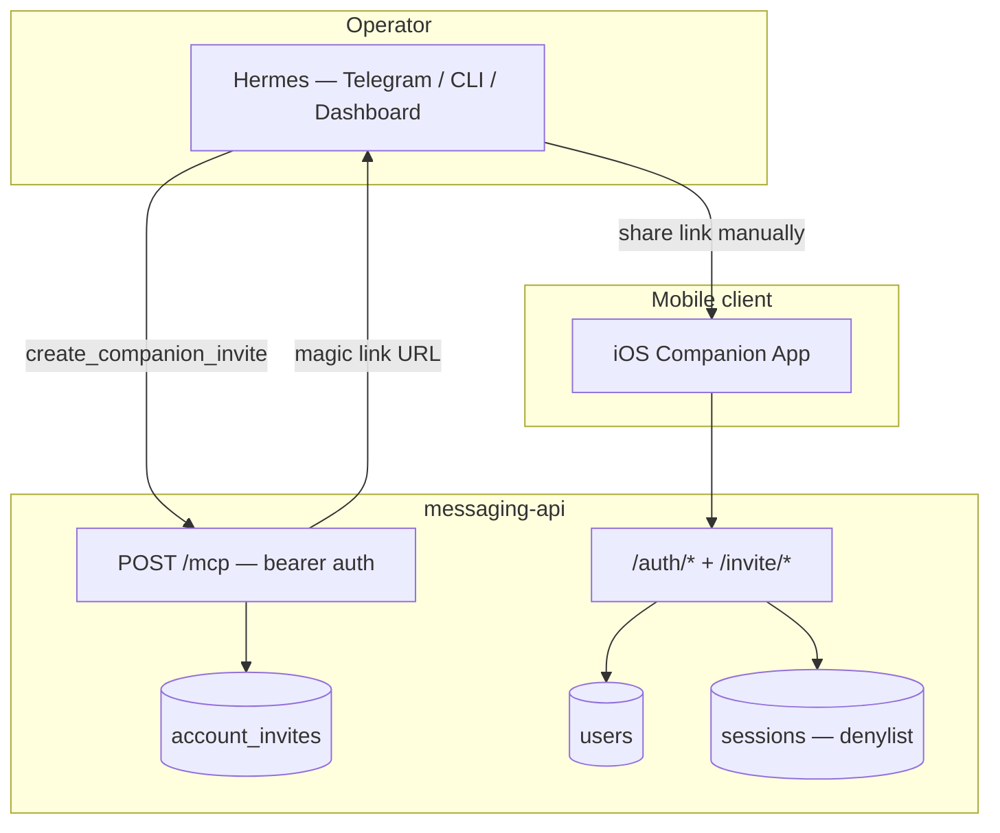

# Companion Auth — Backend Design Spec

**Date:** 2026-06-14  
**Status:** Approved  
**Parent:** `docs/superpowers/specs/2026-06-14-companion-auth-invites-design.md`  
**OpenAPI:** `docs/superpowers/specs/messaging-api.openapi.yaml` (v1.6.0)  
**iOS spec:** `docs/superpowers/specs/2026-06-14-companion-auth-invites-ios-design.md`

---

## Goal

Evolve `messaging-api` auth from a bootstrap-operator model to **invite-based account provisioning** controlled exclusively through Hermes via the companion MCP.

At cold start the API has **zero users**. Hermes creates activation and password-reset invites; invitees complete onboarding through public API routes consumed by the iOS app.

---

## Out of Scope (v1)

- Email or SMS delivery of invites
- Public internet exposure of the messaging API
- Self-service forgot-password without operator involvement
- Account deletion API
- OAuth / third-party identity
- Refresh tokens (long-lived JWT retained)
- iOS UI (see iOS spec — separate agent)

---

## Architecture



### Auth surfaces

| Surface | Auth | Consumer |
|---------|------|----------|
| Channel API (`/conversations/*`, `/data/location/*`) | User JWT | iOS app |
| Account MCP (`POST /mcp`) | `COMPANION_MCP_BEARER_TOKEN` | Hermes |
| Invite completion (`/auth/activate`, `/auth/reset-password`) | One-time invite token | iOS app |
| Invite landing (`GET /invite/:token`) | Token in URL | Browser / app deep link |

---

## Cold Start

- `users` table empty on fresh deploy
- `POST /auth/login` → `401 invalid_credentials` until first activation
- Bootstrap env vars removed: `MESSAGING_API_BOOTSTRAP_USERNAME`, `MESSAGING_API_BOOTSTRAP_PASSWORD`
- Startup password reconciliation in `app.ts` removed

---

## Database

### New table: `account_invites`

```sql
CREATE TABLE account_invites (
  id TEXT PRIMARY KEY,
  token_hash TEXT NOT NULL UNIQUE,
  type TEXT NOT NULL CHECK (type IN ('activation', 'password_reset')),
  label TEXT,
  user_id TEXT,
  revoked_at TEXT,
  expires_at TEXT NOT NULL,
  used_at TEXT,
  created_at TEXT NOT NULL DEFAULT (datetime('now')),
  FOREIGN KEY (user_id) REFERENCES users(id)
);

CREATE INDEX idx_account_invites_token_hash ON account_invites (token_hash);
CREATE INDEX idx_account_invites_active ON account_invites (used_at, revoked_at, expires_at);
```

### `users` changes

Add column:

```sql
ALTER TABLE users ADD COLUMN password_changed_at TEXT;
```

Set on activation and every password change. Auth plugin rejects JWTs whose `iat` is before `password_changed_at`.

Rows created only by `POST /auth/activate`.

---

## API Routes

Contract: OpenAPI v1.6.0. Public routes (no JWT):

- `POST /auth/login`
- `GET /invite/{token}`
- `GET /auth/invite/{token}`
- `POST /auth/activate`
- `POST /auth/reset-password`
- `GET /health`

### `GET /invite/{token}`

Landing route for magic links. Returns `302` to app deep link (`hermes-companion://invite/{token}`) or minimal HTML with "Open in Companion" button. Does not expose user data.

### `GET /auth/invite/{token}`

Returns invite metadata for the app to choose the correct onboarding screen.

Valid activation:

```json
{ "valid": true, "type": "activation", "expires_at": "2026-06-16T12:00:00.000Z" }
```

Invalid:

```json
{ "valid": false, "reason": "expired" }
```

`reason`: `expired` | `used` | `not_found` | `revoked`

### `POST /auth/activate`

Body: `{ token, username, password }`  
Response: `{ token: "<jwt>" }` (1-year expiry)

Errors: `400 invalid_token`, `400 weak_password`, `409 username_taken`

### `POST /auth/reset-password`

Body: `{ token, password }`  
Response: `{ token: "<jwt>" }`

Errors: `400 invalid_token`, `400 weak_password`

On success: update password hash, set `password_changed_at`, mark invite used.

### Unchanged

- `POST /auth/login`
- `POST /auth/logout`
- `GET /auth/me`

### Password policy

- Minimum 12 characters (`MIN_PASSWORD_LENGTH`)
- bcrypt cost 10

---

## MCP Tools

Bearer: `COMPANION_MCP_BEARER_TOKEN` on `POST /mcp`. Not in OpenAPI.

### Account management (new)

| Tool | Input | Output |
|------|-------|--------|
| `create_companion_invite` | `{ label?: string }` | `{ invite_id, url, expires_at }` |
| `create_password_reset_invite` | `{ username: string }` | `{ invite_id, url, expires_at }` or user-not-found error |
| `list_companion_accounts` | `{}` | `{ users: [...], pending_invites: [...] }` |
| `revoke_companion_invite` | `{ invite_id: string }` | `{ ok: true }` |

Magic link format: `http://<MESSAGING_API_HOST>/invite/<raw-token>`

### Location tools (changed)

| Tool | Change |
|------|--------|
| `get_user_location` | Required `username` param; bootstrap binding removed |
| `get_location_history` | Required `username` param |

---

## Token Generation

- Raw: 32 random bytes, base64url (~43 chars)
- Stored: SHA-256 hash only
- Single use via `used_at`
- Default expiry: 48h (`INVITE_EXPIRY_HOURS`)
- Revocation via `revoked_at`

---

## Configuration

### New env vars

```dotenv
MESSAGING_API_HOST=100.x.x.x:3000
INVITE_EXPIRY_HOURS=48
MIN_PASSWORD_LENGTH=12
```

### Removed env vars

```dotenv
MESSAGING_API_BOOTSTRAP_USERNAME
MESSAGING_API_BOOTSTRAP_PASSWORD
```

Update `docker-compose.yml`, `.env.example`, `README.md`.

---

## Hermes Workspace

### Skill: `companion-account-management`

| Operator intent | MCP tool |
|-----------------|----------|
| "Create a companion account for Roberto" | `create_companion_invite({ label: "Roberto" })` |
| "Reset companion password for roberto" | `create_password_reset_invite({ username: "roberto" })` |
| "Who has companion access?" | `list_companion_accounts` |
| "Cancel pending invite …" | `revoke_companion_invite({ invite_id })` |

Present the **full** magic link URL — never truncate the token.

### Skill update: `companion-user-location`

Pass `username` to `get_user_location` and `get_location_history`.

---

## Migration

Existing deployments may have a bootstrap `operator` user. That row persists after upgrade; bootstrap logic is simply removed.

Operator options:

1. Keep `operator` and create more accounts via invites
2. Reset `operator` password via `create_password_reset_invite`
3. Clean slate: delete `messaging-api.sqlite` before boot (loses chat + location history)

---

## Security

| Concern | Mitigation |
|---------|------------|
| Public signup | Invites created only via MCP bearer |
| Token guessing | 256-bit entropy; hashed at rest |
| Token reuse | `used_at` enforced |
| VPN boundary | `MESSAGING_API_HOST` is Tailscale IP |
| Stale JWTs after reset | `password_changed_at` vs JWT `iat` |
| Cross-user location | MCP requires explicit `username` |

---

## Testing

- Cold start: login fails with empty `users`
- MCP activation invite → `POST /auth/activate` → login works
- `409 username_taken`, `400 weak_password`, `400 invalid_token` (expired/used/revoked)
- Password reset invalidates pre-reset JWT
- `revoke_companion_invite` blocks completion
- `list_companion_accounts` lists users + pending invites
- MCP bearer auth rejection
- Location MCP tools require `username`
- No bootstrap user created on startup

---

## File Targets

```
messaging-api/
  src/db/schema.ts
  src/db/repos/account-invites.ts          — NEW
  src/db/repos/users.ts                    — password_changed_at
  src/plugins/auth.ts                      — iat vs password_changed_at
  src/routes/auth.ts                       — activate, reset-password, invite metadata
  src/routes/invite-landing.ts             — NEW: GET /invite/:token
  src/routes/mcp.ts                        — account tools + location username
  src/services/mcp-tools.ts
  src/services/invites.ts                  — NEW: token gen, hash, validate
  src/config.ts
  src/app.ts                               — remove bootstrap hook
  test/auth.test.ts
  test/invites.test.ts                     — NEW
  test/mcp.test.ts

docker-compose.yml
.env.example
README.md
data/skills/companion-account-management/  — NEW
data/skills/companion-user-location/         — update username param
```