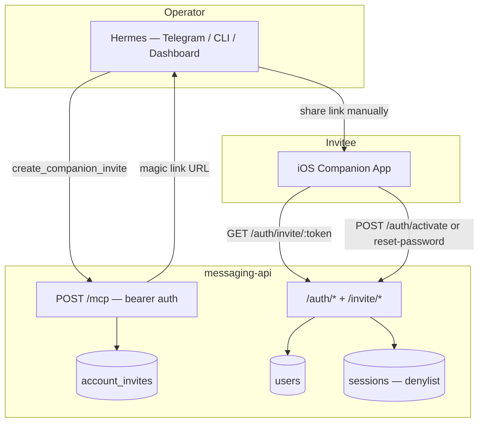

# Companion Auth — Invite-Based Account Management

**Date:** 2026-06-14  
**Status:** Approved  
**OpenAPI:** `docs/superpowers/specs/messaging-api.openapi.yaml` (v1.6.0 — to be drafted)  
**Supersedes:** bootstrap-user auth in `docs/superpowers/implemented/specs/2026-06-12-hermes-messaging-api-design.md` (Auth Model section) and `docs/superpowers/implemented/specs/2026-06-12-hermes-assistant-companion-design.md` (Authentication section)

---

## Goal

Replace the bootstrap-operator auth model with **invite-based account provisioning** controlled exclusively through Hermes via the companion MCP.

At cold start the API has **zero users** and login is impossible until an operator creates the first invite through Hermes. New users complete onboarding via a **VPN-only magic link**, choose their own username, and set their own password. Password resets follow the same magic-link pattern (password only, no username step).

---

## Out of Scope (v1)

- Email or SMS delivery of invites (operator shares links manually)
- Public internet exposure of the messaging API
- Self-service "forgot password" without operator involvement
- Account deletion API (may be added later via MCP)
- OAuth / third-party identity providers
- Refresh tokens or short-lived access tokens (long-lived JWT retained)
- Multi-factor authentication

---

## Architecture



### Auth surfaces

| Surface | Auth mechanism | Who uses it |
|---------|----------------|-------------|
| Channel API (`/conversations/*`, `/data/location/*`, etc.) | User JWT | iOS companion app |
| Account MCP (`POST /mcp`) | `COMPANION_MCP_BEARER_TOKEN` | Hermes only |
| Invite completion (`/auth/activate`, `/auth/reset-password`) | One-time invite token | iOS app on first open / reset |
| Invite landing (`GET /invite/:token`) | None (token in URL) | Browser or app deep link |

---

## Cold Start

On first deploy:

- `users` table is empty
- `POST /auth/login` returns `401 invalid_credentials` for all attempts
- Hermes is the only path to create accounts via MCP `create_companion_invite`
- Bootstrap env vars (`MESSAGING_API_BOOTSTRAP_USERNAME`, `MESSAGING_API_BOOTSTRAP_PASSWORD`) are **removed**
- Startup password reconciliation in `app.ts` is **removed**

---

## Flows

### 1. Create account (operator → invitee)

1. Operator asks Hermes: "Create a companion account for Roberto"
2. Hermes calls MCP `create_companion_invite({ label: "Roberto" })`
3. MCP inserts an `activation` invite, returns a magic link:
   `http://<MESSAGING_API_HOST>/invite/<raw-token>`
4. Hermes presents the link to the operator; operator shares it with the invitee (Messages, etc.)
5. Invitee opens the link on VPN (Tailscale). iOS app intercepts the URL.
6. App calls `GET /auth/invite/:token` → `{ valid: true, type: "activation", expires_at: "..." }`
7. App shows onboarding: **username** + **password** + confirm
8. App calls `POST /auth/activate` with `{ token, username, password }`
9. Server validates token, checks username uniqueness, creates user, marks invite used, returns JWT
10. App stores JWT in Keychain and navigates to `ConversationListView`

### 2. Normal login

Unchanged from current behavior:

- `POST /auth/login` with `{ username, password }` → JWT (1-year expiry)
- `GET /auth/me` with JWT
- `POST /auth/logout` adds token to denylist

### 3. Password reset (operator → user)

1. User tells operator they forgot their password
2. Operator asks Hermes: "Reset companion password for roberto"
3. Hermes calls MCP `create_password_reset_invite({ username: "roberto" })`
4. MCP verifies user exists, inserts `password_reset` invite linked to `user_id`, returns magic link
5. Operator shares link with user
6. User opens link; app calls `GET /auth/invite/:token` → `{ valid: true, type: "password_reset" }`
7. App shows **password + confirm only** (no username)
8. App calls `POST /auth/reset-password` with `{ token, password }`
9. Server updates password hash, marks invite used, invalidates existing JWTs for that user
10. App stores new JWT (or redirects to login — implementation choice in iOS plan)

---

## Database

### New table: `account_invites`

```sql
CREATE TABLE account_invites (
  id TEXT PRIMARY KEY,
  token_hash TEXT NOT NULL UNIQUE,
  type TEXT NOT NULL CHECK (type IN ('activation', 'password_reset')),
  label TEXT,
  user_id TEXT,
  expires_at TEXT NOT NULL,
  used_at TEXT,
  created_at TEXT NOT NULL DEFAULT (datetime('now')),
  FOREIGN KEY (user_id) REFERENCES users(id)
);

CREATE INDEX idx_account_invites_token_hash ON account_invites (token_hash);
CREATE INDEX idx_account_invites_active ON account_invites (used_at, expires_at);
```

### `users` table

No schema change. Rows are created only when `POST /auth/activate` succeeds.

### JWT invalidation on password reset

Add `password_changed_at TEXT` column to `users` (default `NULL`; set on every password change including activation).

Auth plugin rejects JWTs whose `iat` claim is before `password_changed_at`. This invalidates all outstanding tokens without enumerating them in the denylist.

---

## API Routes

### New routes

| Method | Path | Auth | Body | Response |
|--------|------|------|------|----------|
| `GET` | `/invite/:token` | None | — | `302` redirect to app deep link, or minimal HTML "Open in Companion" page |
| `GET` | `/auth/invite/:token` | None | — | Invite metadata (see below) |
| `POST` | `/auth/activate` | None | `{ token, username, password }` | `{ token: "<jwt>" }` |
| `POST` | `/auth/reset-password` | None | `{ token, password }` | `{ token: "<jwt>" }` |

**`GET /auth/invite/:token` — valid activation:**

```json
{
  "valid": true,
  "type": "activation",
  "expires_at": "2026-06-16T12:00:00.000Z"
}
```

**`GET /auth/invite/:token` — invalid:**

```json
{
  "valid": false,
  "reason": "expired"
}
```

`reason` is one of: `expired`, `used`, `not_found`, `revoked`.

### Unchanged routes

- `POST /auth/login`
- `POST /auth/logout`
- `GET /auth/me`

### Error codes

| Code | When |
|------|------|
| `400 invalid_request` | Malformed body |
| `400 invalid_token` | Invite missing, expired, used, or revoked |
| `400 weak_password` | Password below minimum length |
| `409 username_taken` | Username already exists at activation |
| `401 invalid_credentials` | Login failure (unchanged) |

### Password policy

- Minimum length: **12 characters** (configurable via `MIN_PASSWORD_LENGTH`)
- bcrypt hashing (unchanged, cost factor 10)

---

## MCP Tools

All tools require `Authorization: Bearer <COMPANION_MCP_BEARER_TOKEN>` on `POST /mcp`.

### Account management (new)

#### `create_companion_invite`

```json
{ "label": "Roberto" }
```

`label` is optional — operator-facing note, not used for login.

Returns:

```json
{
  "invite_id": "uuid",
  "url": "http://100.x.x.x:3000/invite/<raw-token>",
  "expires_at": "2026-06-16T12:00:00.000Z"
}
```

#### `create_password_reset_invite`

```json
{ "username": "roberto" }
```

Returns same shape as above. Error if user not found.

#### `list_companion_accounts`

```json
{}
```

Returns:

```json
{
  "users": [
    { "id": "uuid", "username": "roberto", "created_at": "..." }
  ],
  "pending_invites": [
    { "id": "uuid", "type": "activation", "label": "Roberto", "expires_at": "..." }
  ]
}
```

#### `revoke_companion_invite`

```json
{ "invite_id": "uuid" }
```

Marks invite as revoked (or deletes row). Unused invites only.

### Location tools (changed)

`get_user_location` and `get_location_history` gain a required `username` parameter. The implicit bootstrap-user binding is removed.

```json
{ "username": "roberto" }
```

---

## Token Generation

- Raw token: 32 random bytes, base64url-encoded (~43 chars)
- Stored value: SHA-256 hash of raw token (never store plaintext)
- Single use: `used_at` set on completion
- Default expiry: **48 hours** from creation (configurable via `INVITE_EXPIRY_HOURS`)
- Revoked invites return `reason: "revoked"` on lookup

---

## Configuration

### New env vars

```dotenv
MESSAGING_API_HOST=100.x.x.x:3000
INVITE_EXPIRY_HOURS=48
MIN_PASSWORD_LENGTH=12
```

`MESSAGING_API_HOST` is the Tailscale-reachable host used in magic link URLs. VPN-only by network placement — the API is not exposed to the public internet.

### Removed env vars

```dotenv
MESSAGING_API_BOOTSTRAP_USERNAME   # removed
MESSAGING_API_BOOTSTRAP_PASSWORD   # removed
```

---

## iOS Companion Changes

### Deep link handling

Register universal link or custom URL scheme for `http://<MESSAGING_API_HOST>/invite/*`.

On URL open:

1. Extract raw token from path
2. `GET /auth/invite/:token`
3. Route by `type`:
   - `activation` → `ActivateAccountView` (username + password + confirm)
   - `password_reset` → `ResetPasswordView` (password + confirm)
4. Submit to `POST /auth/activate` or `POST /auth/reset-password`
5. On success: store JWT in Keychain, navigate to `ConversationListView`
6. On `valid: false`: show error ("This link has expired. Contact the operator.")

### Login screen

Unchanged for returning users. No registration UI — accounts are invite-only.

### Supersedes iOS auth design

The original design (`LoginView` with pre-provisioned credentials) is replaced by:

- `LoginView` for returning users
- `ActivateAccountView` for magic-link onboarding
- `ResetPasswordView` for magic-link password reset

---

## Hermes Skill: `companion-account-management`

New skill in `data/skills/`. Calls companion MCP account tools.

| Operator intent | MCP tool |
|-----------------|----------|
| "Create a companion account for Roberto" | `create_companion_invite({ label: "Roberto" })` |
| "Reset companion password for roberto" | `create_password_reset_invite({ username: "roberto" })` |
| "Who has companion access?" | `list_companion_accounts` |
| "Cancel the pending invite for Roberto" | `revoke_companion_invite({ invite_id })` |

After `create_companion_invite` or `create_password_reset_invite`, Hermes must present the full magic link URL to the operator for manual sharing. Never truncate the token.

Location questions continue to use the `companion-user-location` skill (updated to pass `username`).

---

## Migration

No user data migration required. The current deployment has a single bootstrap `operator` user.

**Operator action at upgrade:**

1. Deploy new API (bootstrap logic removed)
2. Existing `operator` user remains in DB and can still log in
3. Create additional accounts via Hermes invites as needed
4. Optionally reset the operator password via `create_password_reset_invite` to move off the old bootstrap password

If a clean-slate deploy is preferred, delete `messaging-api.sqlite` before first boot (loses conversations and location history).

---

## Security

| Concern | Mitigation |
|---------|------------|
| Public account creation | No registration endpoint; MCP bearer required to create invites |
| Token guessing | 256-bit entropy; hashed at rest |
| Token reuse | `used_at` enforced; second attempt returns `invalid_token` |
| VPN boundary | Magic links use Tailscale IP; API not published publicly |
| Password quality | Server-side minimum length |
| Stale JWTs after reset | `password_changed_at` vs JWT `iat` check in auth plugin |
| Cross-user location | MCP location tools require explicit `username` |

---

## Testing

### API unit/integration tests

- Cold start: login fails with empty `users` table
- `create_companion_invite` via MCP → valid activation flow end-to-end
- Activation: username uniqueness (`409`), weak password (`400`), expired token (`400`)
- Password reset: invalidates old JWT, new login works
- `revoke_companion_invite` prevents completion
- `list_companion_accounts` returns users and pending invites
- MCP rejects missing/invalid bearer token
- Location MCP tools require `username` and resolve correct user
- Bootstrap env vars no longer create users on startup

### iOS tests (separate plan)

- Deep link parsing
- Activation and reset UI flows
- Error states for expired/used tokens

---

## OpenAPI

Bump to **v1.6.0** with new auth routes, invite schemas, and updated MCP tool descriptions. MCP itself remains outside OpenAPI (bearer-protected `POST /mcp`).

---

## Implementation Order

1. **Backend** — schema, invite routes, MCP account tools, remove bootstrap, update location MCP tools, tests
2. **Hermes workspace** — `companion-account-management` skill, update `companion-user-location` skill, README and `.env.example`
3. **iOS** — deep link handling, activation/reset views (separate machine)