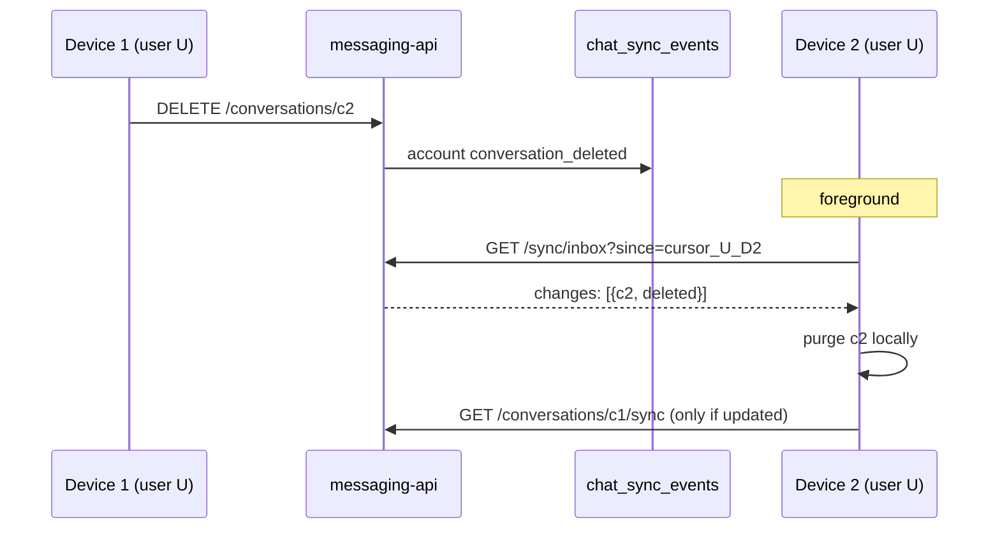

# Companion Sync Inbox — Backend Design Spec

**Date:** 2026-06-20  
**Status:** Approved (brainstorm)  
**API version:** v2.6.0 (OpenAPI)  
**OpenAPI:** `docs/superpowers/specs/messaging-api.openapi.yaml`  
**Consumer:** `assistant-companion` (iOS)  
**Related specs:** `docs/history/implemented/specs/2026-06-17-companion-chat-local-sync-backend-design.md`  
**iOS reference:** `docs/superpowers/specs/2026-06-20-companion-sync-inbox-ios-design.md`

---

## Goal

Add a **per-device sync inbox** so each logged-in user on each physical device can poll a coalesced “what changed?” feed, then run targeted thread sync — without replaying every action or polling every conversation.

Kafka **pattern**, SQLite **implementation**. No message broker on the Pi.

---

## Multi-user model

The deployment supports **multiple companion users**. Streams are **never shared across users**.

| Concept | Scope | Notes |
|---------|-------|-------|
| **Event stream (topic)** | One per `user_id` | Existing `chat_sync_events` account-scope rows |
| **Consumer group** | One per `(user_id, device_id)` | Independent cursor per user on the same phone |
| **Inbox poll** | JWT `sub` only | Authenticated user sees only their stream |
| **Device registration** | Per user | Same `device_id` string may appear under multiple users as separate rows |

**Not in scope:** cross-user fan-out, shared streams, or operator-visible merged feeds.

### Account switch (iOS)

When the app logs out user A and logs in user B on the same phone:

- `device_id` stays the same (install-scoped)
- Cursor is loaded/stored for **(B, device_id)** — not A’s cursor
- Local SwiftData is already user-scoped; inbox only drives reconciliation for the active account

---

## Problem

v2.1 sync works but multi-device reconciliation is fragile because:

1. Cursors are per-feed (account + each thread), not per **device**
2. Clients must infer which threads changed from account events or poll broadly
3. Re-login mints a new JWT `jti` — not a stable consumer identity
4. Deletes and rewinds are easy to miss without disciplined foreground account sync

---

## Architecture



| Layer | Route | Role |
|-------|-------|------|
| **Inbox** | `GET /sync/inbox` | Coalesced dirty set per device cursor |
| **Account sync** | `GET /conversations/sync` | Full event log; bootstrap + fallback |
| **Thread sync** | `GET /conversations/:id/sync` | Message-level apply for dirty threads |
| **HAL history** | `GET /conversations`, `GET /messages` | Hydration; fallback rebuild |

Existing mutation paths continue appending to `chat_sync_events`. Inbox is a **read projection** over the account feed.

---

## Decisions

| Topic | Choice |
|-------|--------|
| Broker | None — SQLite event log |
| Stream key | `user_id` |
| Consumer key | `(user_id, device_id)` |
| `device_id` | Stable install UUID from iOS; registered via API |
| Coalescing | Server-side per `conversation_id` in cursor window |
| Fallback | `reset_required` when cursor invalid or gap too large |
| Thread sync | Unchanged; inbox only selects targets |
| Push | Out of scope; foreground + optional BG poll |

---

## SQLite schema

### `device_sync_state`

```sql
CREATE TABLE device_sync_state (
  user_id TEXT NOT NULL,
  device_id TEXT NOT NULL,
  last_account_event_id TEXT,
  created_at TEXT NOT NULL DEFAULT (datetime('now')),
  updated_at TEXT NOT NULL DEFAULT (datetime('now')),
  PRIMARY KEY (user_id, device_id),
  FOREIGN KEY (user_id) REFERENCES users(id) ON DELETE CASCADE
);

CREATE INDEX device_sync_state_user_idx ON device_sync_state (user_id);
```

- `last_account_event_id` — cursor into account-scoped `chat_sync_events.id`
- `NULL` cursor = never synced; first inbox call may trigger bootstrap path

### `device_registrations` (optional merge with push)

If `push_devices` already stores `device_token` per upsert, add:

```sql
-- extend push_devices OR separate table:
device_install_id TEXT NOT NULL  -- stable device_id from client
```

Minimum v2.6.0: **`PUT /devices/me`** upserts `(user_id, device_id)` even when push is disabled.

---

## REST API (v2.6.0)

### `PUT /devices/me`

Register or refresh the stable install identity for the authenticated user.

**Auth:** JWT  
**Body:**

```json
{
  "device_id": "550e8400-e29b-41d4-a716-446655440000"
}
```

| Field | Rules |
|-------|-------|
| `device_id` | Required UUID |

**Behavior:**

- Upsert `device_sync_state` row for `(request.userId, device_id)` if missing
- `200 { "ok": true }`
- Does not reset cursor on re-register

### `GET /sync/inbox`

Coalesced change set for this **user + device** since the stored cursor.

**Auth:** JWT  
**Query:**

| Param | Required | Notes |
|-------|----------|-------|
| `device_id` | yes | Must match a row registered via `PUT /devices/me` for this user |
| `since` | no | Override stored cursor (advanced); omit to use server-stored cursor |

**Normal response (coalesced — mode B):**

```json
{
  "changes": [
    { "conversation_id": "c2", "kind": "deleted" },
    { "conversation_id": "c1", "kind": "updated" }
  ],
  "next_cursor": "evt-uuid-99",
  "has_more": false,
  "reset_required": false
}
```

| `changes[].kind` | Client action |
|------------------|---------------|
| `deleted` | Purge conversation + messages locally; tombstone |
| `updated` | Run `GET /conversations/{id}/sync` (and apply snapshot even if `events` empty) |

**Coalescing rules** (within cursor window, per `conversation_id`):

1. If any account `conversation_deleted` → `kind: "deleted"` (wins)
2. Else if any account `conversation_upsert` **or** any conversation-scoped event for that id → `kind: "updated"`
3. At most one change row per conversation
4. Return `deleted` rows before `updated`; `updated` ordered by latest activity desc

After successful response, persist `next_cursor` to `device_sync_state` for `(user_id, device_id)`.

**Fallback response (mode C):**

```json
{
  "changes": [],
  "next_cursor": "evt-uuid-tip",
  "has_more": false,
  "reset_required": true
}
```

**Triggers for `reset_required: true`:**

| Condition | Action |
|-----------|--------|
| Stored/`since` cursor not found in log (and not origin sentinel) | Fallback |
| Account events since cursor > `SYNC_INBOX_MAX_GAP` (default 500) | Fallback |
| `device_id` unknown for user | `400 invalid_request` — client must `PUT /devices/me` first |

**Client on `reset_required`:**

1. Clear device cursor and all per-thread markers for this user
2. `GET /conversations/sync` with `since` omitted; paginate; apply all events
3. HAL-rehydrate open/recent threads
4. Set device cursor to account tip; resume inbox polling

**Errors:**

| Code | When |
|------|------|
| `400 invalid_request` | Bad `device_id`, unknown device, bad params |
| `401` | Unauthenticated |

---

## Inbox implementation (backend)

```typescript
function buildInbox(
  userId: string,
  deviceId: string,
  sinceEventId: string | null,
): InboxResult
```

1. Load `device_sync_state` for `(userId, deviceId)`; resolve `since` from query or stored cursor
2. If `since` is null → return `reset_required: true` (first-time bootstrap via C)
3. Fetch account events after `since` up to `SYNC_INBOX_MAX_GAP + 1`
4. If count > `SYNC_INBOX_MAX_GAP` → `reset_required: true`
5. Coalesce to `changes[]`
6. `next_cursor` = latest account event id for user (feed tip), or origin sentinel if empty

Config:

| Env | Default |
|-----|---------|
| `SYNC_INBOX_MAX_GAP` | `500` |

---

## Producer paths (unchanged)

All existing emitters stay:

- `emitAccountConversationUpsert`
- `emitConversationDeleted`
- `emitConversationMessageUpsert`
- `emitConversationMessagesRewound`

No duplicate writes for inbox — projection reads `chat_sync_events` only.

---

## Security

- Inbox queries filter `user_id = JWT sub` always
- `device_id` must be registered for that same user
- One user cannot read another user’s cursor or changes
- `device_id` is an opaque client identifier, not a secret; auth is JWT

---

## iOS consumer summary

See iOS reference spec. In brief:

1. Generate `device_id` once per install; persist in Keychain
2. `PUT /devices/me` after login
3. On foreground: `GET /sync/inbox?device_id=…`
4. Apply `changes`; thread-sync only `updated` conversations
5. On `reset_required`: full account bootstrap (C)
6. On logout: do not delete `device_id`; clear in-memory cursor for user

---

## Backward compatibility

- Existing `GET /conversations/sync` and thread sync unchanged
- Old clients ignore inbox
- New clients use inbox as primary dirty detector; thread sync for apply

---

## Out of scope (v1)

- Kafka / Redpanda
- Cross-user streams
- Push-wake inbox poll
- Offline mutation queue
- Server-side thread body in inbox (coarse pointers only)

---

## Acceptance criteria

1. User U on device D1 and D2 have **independent** cursors.
2. User V on the same phone as U has a **separate** cursor (different `user_id`).
3. Delete on D1 appears as `{kind: "deleted"}` on D2 inbox after poll.
4. Ten message events on conv A collapse to one `{kind: "updated"}` for A.
5. Invalid cursor returns `reset_required`; client rebuilds via account sync.
6. Gap > 500 events returns `reset_required`.
7. Inbox never returns another user’s `conversation_id`.

---

## OpenAPI

Bump to **v2.6.0** with `GET /sync/inbox`, `PUT /devices/me`, inbox schemas, changelog entry pointing to this spec.