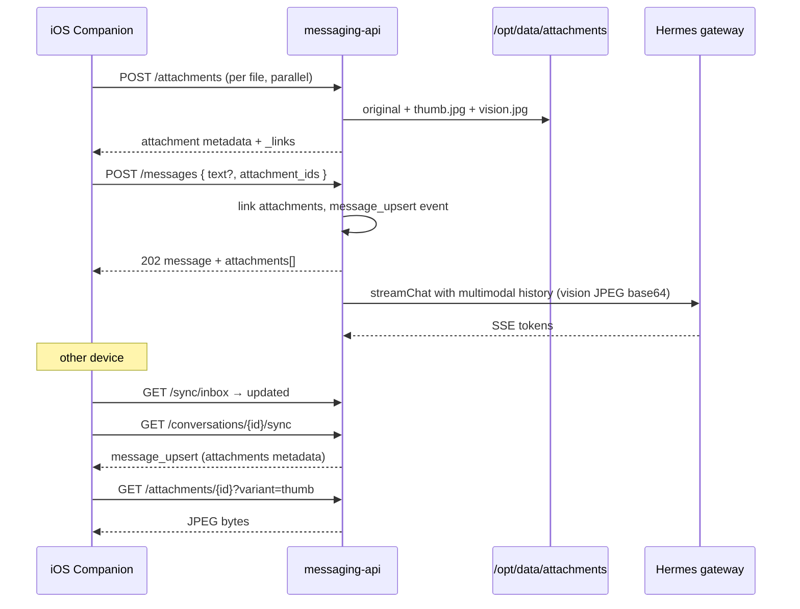

# Companion Photo Sharing — Backend Design Spec

**Date:** 2026-06-21  
**Status:** Approved  
**API version:** v2.8.0 (OpenAPI)  
**OpenAPI:** `docs/superpowers/specs/messaging-api.openapi.yaml`  
**Consumer:** `assistant-companion` (iOS)  
**iOS reference:** `docs/superpowers/specs/2026-06-21-companion-photo-sharing-ios-design.md`

---

## Goal

Let companion users attach up to **10 photos** (camera or library) with an optional **shared caption** to a chat message. Photos appear in the transcript, sync across devices, and are sent to Hermes as **vision input** on every subsequent turn in the conversation (ChatGPT-style full-history multimodal context), with guardrails for Pi storage and token cost.

---

## Requirements (approved)

| Topic | Choice |
|-------|--------|
| Purpose | Photos as conversation context — user photographs something and asks about it |
| UX | Composer attach (like location toolbar) → optional caption → send |
| Photos per message | 1–10, shared caption |
| Sources | Camera + Photo Library |
| Hermes context | Full conversation history (option C); images from prior photo messages re-included until context cap prunes oldest |
| Formats | Store **original**; generate **thumb** + **vision JPEG** derivatives server-side |
| Message edit | **Caption only** in v1 — attachments immutable after send |
| Upload flow | **Staged upload** (Approach B): `POST /attachments` then `POST /messages` |
| Authorization | **User-scoped** — JWT `sub` owns attachments; cross-user access returns `404` |
| Sync | Existing inbox + thread sync; metadata in `message_upsert`; bytes via `GET /attachments/:id` |

---

## Out of scope (v1)

- Assistant sending images
- Full photo edit (add/remove/reorder attachments)
- Cross-conversation attachment reuse
- MCP tools or skills for photo vault
- Telegram / other channel photo ingest
- Animated GIF / video
- Push rich media (APNs stays text preview)

---

## Architecture



| Layer | Role |
|-------|------|
| **Attachments API** | Ingest, derive, store, serve files |
| **Messages API** | Link staged attachments; caption-only PATCH |
| **Sync** | `message_upsert` carries `attachments[]` metadata (no bytes) |
| **Prompt builder** | Build OpenAI-compatible multimodal user turns from history |
| **Hermes client** | Send `content` arrays with `text` + `image_url` parts |

---

## Authorization

Every `message_attachments` row has `user_id`.

| Route | Check |
|-------|-------|
| `POST /attachments` | Sets `user_id` from JWT |
| `GET /attachments/:id` | `attachment.user_id === request.userId` else `404` |
| `POST /messages` | Conversation owned by user; each `attachment_id` owned by user, unattached, not expired |
| `PATCH /messages/:id` | Same as edit today + message has attachments; body is caption text only |

Cross-user requests return `404` (not `403`), matching conversation routes.

---

## SQLite schema

```sql
CREATE TABLE message_attachments (
  id TEXT PRIMARY KEY,
  user_id TEXT NOT NULL REFERENCES users(id) ON DELETE CASCADE,
  message_id TEXT,
  position INTEGER NOT NULL DEFAULT 0,
  content_type TEXT NOT NULL,
  byte_size INTEGER NOT NULL,
  width INTEGER,
  height INTEGER,
  original_path TEXT NOT NULL,
  thumb_path TEXT NOT NULL,
  vision_path TEXT NOT NULL,
  created_at TEXT NOT NULL DEFAULT (datetime('now')),
  expires_at TEXT,
  FOREIGN KEY (message_id) REFERENCES messages(id) ON DELETE CASCADE
);

CREATE INDEX message_attachments_user_unattached_idx
  ON message_attachments (user_id, expires_at)
  WHERE message_id IS NULL;

CREATE INDEX message_attachments_message_idx
  ON message_attachments (message_id, position);
```

- `messages.content` remains the caption string (`""` when photo-only).
- `message_id` is `NULL` between upload and send (staged).
- `expires_at` set to `now + 24h` on upload; cleared when attached.
- `ON DELETE CASCADE` from messages removes attachment rows; filesystem cleanup in application code.

---

## Disk storage

Base path: `/opt/data/attachments/{user_id}/{attachment_id}/`

| File | Purpose |
|------|---------|
| `original.*` | As uploaded (HEIC, JPEG, PNG) |
| `thumb.jpg` | ~200px long edge for chat bubbles + fast sync render |
| `vision.jpg` | ~1536px long edge, JPEG ~q80 for Hermes |

Bind mount `${HERMES_DATA_DIR}:/opt/data` — same persistence model as SQLite and vault.

---

## REST API (v2.8.0)

### `POST /attachments`

**Auth:** JWT  
**Body:** `multipart/form-data`, field `file` (one image per request)

**Accepted types:** `image/jpeg`, `image/png`, `image/heic`, `image/heif`  
**Max size:** 20 MB per file (ChatGPT parity)

**Processing:**

1. Validate mime + size
2. Write original to disk
3. Generate `thumb.jpg` and `vision.jpg` (use `sharp` or equivalent)
4. Insert row with `message_id = NULL`, `expires_at = now + 24h`

**Response `201`:**

```json
{
  "attachment": {
    "id": "uuid",
    "content_type": "image/heic",
    "byte_size": 2400000,
    "width": 4032,
    "height": 3024,
    "_links": {
      "self": { "href": "/attachments/uuid" },
      "thumb": { "href": "/attachments/uuid?variant=thumb" }
    }
  }
}
```

Client parallelizes up to 10 uploads before send.

### `GET /attachments/{id}`

**Auth:** JWT (owner only)  
**Query:** `variant=original|thumb|vision` (default `original`)

**Response:** `200` with `Content-Type` matching variant; `Cache-Control: private, max-age=31536000` (immutable id).

### `POST /conversations/{id}/messages` (extended)

**Body:**

```json
{
  "text": "what brand is this?",
  "attachment_ids": ["uuid-1", "uuid-2"]
}
```

| Rule | Value |
|------|-------|
| `attachment_ids` | Optional; 1–10 when present |
| Content requirement | At least one of non-empty `text` or non-empty `attachment_ids` |
| Attachment state | Each id: owned by user, `message_id IS NULL`, not expired |
| Ordering | Array order = display / vision order (`position` 0..n-1) |

On success: link attachments, emit `message_upsert`, start assistant run (same `202` flow as text).

### `PATCH /conversations/{id}/messages/{message_id}` (extended)

Caption-only edit for messages with attachments:

- Body: `{ "text": "..." }` only (no `attachment_ids`)
- Rejects if client sends `attachment_ids`
- Rejects if message has no attachments and body would be identical to text-only edit rules today
- Triggers rewind + rerun (existing edit semantics); attachments unchanged

### `Message` schema (OpenAPI)

Add optional `attachments` array on `Message`. Omitted on text-only messages.

```yaml
AttachmentSummary:
  required: [id, content_type, byte_size, position]
  properties:
    id: { type: string, format: uuid }
    content_type: { type: string }
    byte_size: { type: integer }
    width: { type: integer, nullable: true }
    height: { type: integer, nullable: true }
    position: { type: integer, minimum: 0 }
    _links:
      type: object
      properties:
        self: { $ref: '#/components/schemas/HalLink' }
        thumb: { $ref: '#/components/schemas/HalLink' }
```

---

## Sync

No new sync event types. Photo messages use existing `message_upsert`.

| What syncs | How |
|------------|-----|
| Message + caption + `attachments[]` metadata | `GET /conversations/{id}/sync`, HAL `GET /messages` |
| Image bytes | Lazy `GET /attachments/{id}?variant=thumb` (render), `original` on zoom |
| Inbox | `kind: updated` on conversation when photo message commits |
| Rewind / delete | `messages_rewound` / `message_deleted` → client purges local cache |
| Caption edit | `message_upsert` with new `content`, same attachment ids |

**Push (if enabled):** text preview only — caption or fallback `"Photo"`; no image in APNs payload.

---

## Hermes multimodal prompt

`buildHermesMessages` loads attachments for each user message in history.

**User message with photos:**

```json
{
  "role": "user",
  "content": [
    { "type": "text", "text": "what brand is this?" },
    { "type": "image_url", "image_url": { "url": "data:image/jpeg;base64,..." } }
  ]
}
```

| Rule | Value |
|------|-------|
| Image source | Read `vision.jpg` from disk, base64 data URL |
| Text part | Omitted when caption empty (photo-only message) |
| History | All prior user photo messages included on every run (option C) |
| Context cap | Env `VISION_HISTORY_MAX_BYTES` (default 8_388_608). When exceeded, drop `image_url` parts from **oldest** photo messages first; never drop text parts |
| Assistant turns | Text-only (unchanged) |
| `HermesPromptMessage.content` | `string \| ContentPart[]` — extend type |

`hermes-client` already parses array content on the response side; extend the request payload to send arrays.

---

## Orphan cleanup

Background job (or lazy sweep on `POST /attachments`):

- Delete rows where `message_id IS NULL AND expires_at < now`
- Remove filesystem directories

---

## Error handling

| Situation | HTTP | `error` |
|-----------|------|---------|
| Missing / invalid JWT | 401 | `unauthorized` |
| Attachment not found or wrong user | 404 | `not_found` |
| Conversation not found / wrong user | 404 | `not_found` |
| Invalid multipart / missing file | 400 | `invalid_request` |
| Unsupported mime type | 400 | `unsupported_media_type` |
| File too large (> 20 MB) | 400 | `payload_too_large` |
| > 10 attachment_ids on send | 400 | `invalid_request` |
| Attachment already attached / expired / wrong user | 400 | `invalid_request` |
| Send with neither text nor attachments | 400 | `invalid_request` |
| PATCH with `attachment_ids` or photo swap | 400 | `edit_not_allowed` |
| Edit rules violated (not last user turn, etc.) | 400 | `edit_not_allowed` |
| Derivative generation failed | 500 | `processing_failed` |
| Hermes vision model error | 502 | `upstream_error` (existing run failure path) |

**iOS client guidance:**

| State | UX |
|-------|-----|
| Upload in progress | Show per-thumbnail spinner in composer strip |
| Upload failed | Retry per file; do not enable send until all staged succeed or user removes failed item |
| Send failed after upload | Attachments remain staged server-side (not expired if within 24h); retry send |
| Thumb download failed on sync | Placeholder + tap-to-retry |
| `processing_failed` | Toast; remove from composer |

---

## Guardrails

| Limit | Value |
|-------|-------|
| Photos per message | 10 |
| Max original size | 20 MB / file |
| Vision derivative | ~1536px long edge JPEG |
| Thumb | ~200px long edge JPEG |
| Orphan TTL | 24 hours |
| Vision history cap | 8 MB total `vision.jpg` bytes in prompt (configurable) |
| Accepted formats | JPEG, PNG, HEIC/HEIF |

---

## Configuration (env)

| Variable | Default | Purpose |
|----------|---------|---------|
| `ATTACHMENTS_DIR` | `/opt/data/attachments` | Storage root |
| `ATTACHMENT_MAX_BYTES` | `20971520` | Per-file upload cap |
| `ATTACHMENT_ORPHAN_TTL_HOURS` | `24` | Unattached expiry |
| `VISION_MAX_EDGE_PX` | `1536` | Hermes derivative |
| `THUMB_MAX_EDGE_PX` | `200` | UI thumbnail |
| `VISION_HISTORY_MAX_BYTES` | `8388608` | Prompt pruning threshold |

---

## Verification checklist

### Backend

- [ ] Upload HEIC → original preserved, thumb + vision JPEG created
- [ ] Upload 11th staged attachment before send — rejected on message POST, not on 11th upload (client caps at 10; server validates on send)
- [ ] Send photo-only message (empty caption) → Hermes receives image-only user turn
- [ ] Follow-up text message in same conversation → Hermes prompt still includes prior images
- [ ] User A cannot `GET` user B's attachment (`404`)
- [ ] `message_upsert` on second device includes `attachments[]`; thumb download works
- [ ] Caption PATCH → rewind + rerun; attachments unchanged
- [ ] Conversation delete → attachment files removed from disk
- [ ] Orphan past TTL → row + files deleted
- [ ] Vision history cap → oldest images dropped, text retained

### Operator

- [ ] `make up` with bind mount; attachments persist across restart
- [ ] README note for storage growth under `data/attachments/`

---

## OpenAPI

Bump to **v2.8.0** in the same change set:

- `AttachmentSummary`, `AttachmentUploadResponse`
- Extend `Message`, `CreateMessageRequest`, `EditMessageRequest`
- New paths: `POST /attachments`, `GET /attachments/{id}`
- Changelog entry referencing this spec

---

## iOS impact

See `docs/superpowers/specs/2026-06-21-companion-photo-sharing-ios-design.md`. Requires companion app update for composer, upload pipeline, attachment rendering, and local cache.